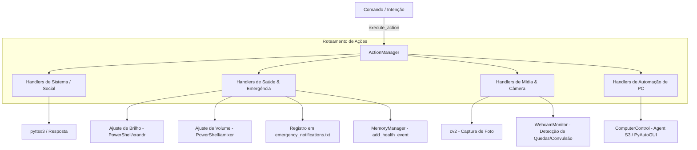

# Documentação Técnica: Gerenciador de Ações (`.kamila/core/actions.py`)

Esta documentação descreve em detalhes o funcionamento do módulo **`actions.py`**, representado pela classe `ActionManager`. Este módulo é o coração executivo do projeto **Kamila**, responsável por receber intenções interpretadas e traduzi-las em ações do sistema operacional, protocolos de emergência/saúde, automações de computador e síntese de resposta.

---

## 1. Visão Geral do `ActionManager`

O `ActionManager` atua como um padrão **Command / Dispatcher**, mapeando strings de intenção (provenientes do `CommandInterpreter`) para funções tratadoras (*handlers*).



---

## 2. Estrutura e Atributos da Classe

### 2.1 Construtor (`__init__`)
```python
def __init__(self, tts_engine=None, memory_manager=None):
```
- **`memory_manager`**: Instância do `MemoryManager` para gravação de eventos de saúde e diário.
- **`tts_engine`**: Instância do `TTSEngine` para feedback vocal.
- **`actions`**: Dicionário contendo a tabela de rotas de todas as ações disponíveis.
- **`system_status`**: Dicionário de rastreamento do estado do sistema (`last_action`, `last_action_time`, `active_actions`).
- **`computer_control`**: Instância preguiçosa (*lazy loading*) do módulo `ComputerControl`.

---

## 3. Tabela de Intenções e Handlers (`_load_actions`)

O método `_load_actions()` define todas as ações suportadas. A tabela a seguir descreve cada uma delas:

| Intenção | Método Handler | Descrição Funcional |
| :--- | :--- | :--- |
| `greeting` | `_handle_greeting` | Retorna saudação contextual baseada no horário do dia. |
| `goodbye` | `_handle_goodbye` | Retorna mensagem de despedida amigável. |
| `time` | `_handle_time` | Retorna a hora atual formatada (`HH:MM`). |
| `date` | `_handle_date` | Retorna a data atual completa (ex: *"Quinta-feira, 23 de Julho de 2026"*). |
| `weather` | `_handle_weather` | Inicia fluxo de consulta de previsão do tempo. |
| `help` | `_handle_help` | Exibe o menu completo de ajuda e comandos disponíveis. |
| `status` | `_handle_status` | Retorna a confirmação de que a assistente está operacional. |
| `music` | `_handle_music` | Roteia intenções de controle e reprodução de mídia. |
| `lights` | `_handle_lights` | Roteia comandos para controle de iluminação inteligente. |
| `volume` | `_handle_volume` | Roteia ajustes de áudio. |
| `open_app` | `_handle_open_app` | Extrai o nome da aplicação do comando e simula abertura. |
| `search` | `_handle_search` | Extrai termos de pesquisa na web. |
| `calculate` | `_handle_calculate` | Processa solicitações de cálculos matemáticos. |
| `camera_monitor` | `_handle_camera_monitor` | Abre a webcam via `cv2`, tira um *snapshot* e salva no disco. |
| `start_monitoring` | `_handle_start_monitoring` | Inicializa a vigilância em tempo real por `WebcamMonitor`. |
| `stop_monitoring` | `_handle_stop_monitoring` | Interrompe a vigilância por webcam. |
| `monitoring_status` | `_handle_monitoring_status` | Verifica o estado da vigilância por webcam. |
| `clear_history` | `_handle_clear_history` | Limpa o histórico de conversações. |
| `health_protocol` | `_handle_health_protocol` | Executa o protocolo completo de apoio a emergências de saúde. |
| `dim_lights` | `_handle_dim_lights` | Reduz o brilho da tela para 30%. |
| `lower_volume` | `_handle_lower_volume` | Reduz o volume do sistema operacional. |
| `emergency_contact` | `_handle_emergency_contact` | Dispara o envio de alertas a contatos de emergência. |
| `record_crisis` | `_handle_record_crisis` | Grava detalhes de uma crise de saúde no `MemoryManager`. |
| `daily_checkin` | `_handle_daily_checkin` | Pergunta sobre o bem-estar do usuário no dia. |
| `medication_reminder` | `_handle_medication_reminder` | Emite lembrete sonoro para administração de medicamentos. |
| `execute_on_pc` | `_handle_execute_on_pc` | Envia comandos de linguagem natural para o `ComputerControl` (Agent S3). |

---

## 4. Detalhamento dos Principais Sub-Sistemas

### 4.1 Protocolo de Saúde e Emergência (`_handle_health_protocol`)
Quando uma emergência ou solicitação de ajuda médica é detectada, o método `_handle_health_protocol()` executa em sequência:
1. **`_dim_screen_brightness()`**: Reduz o brilho da tela para 30% usando WMI/PowerShell (no Windows) ou `xrandr` (no Linux), visando evitar estímulos luminosos intensos (útil para quadros epilépticos).
2. **`_lower_system_volume()`**: Reduz o volume do áudio do sistema para proporcionar um ambiente calmo.
3. **`_activate_health_monitoring()`**: Coloca o `WebcamMonitor` em modo intensivo (`health_mode = True`).
4. **`_notify_emergency_contacts()`**: Grava um registro com marcação temporal em `emergency_notifications.txt` e dispara alertas de log.

### 4.2 Registro Estruturado de Crises (`_handle_record_crisis`)
- Extrai os detalhes descritos pelo usuário.
- Cria uma estrutura JSON contendo sintomas e horário.
- Invoca `memory_manager.add_health_event(event_type="crise", details=...)`, registrando o fato de forma permanente na memória vetorial (ChromaDB) para posterior acompanhamento médico.

### 4.3 Automação e Controle de Computador (`_handle_execute_on_pc`)
- Verifica se a instância `computer_control` foi carregada com sucesso.
- Passa a instrução do usuário (ex: *"abrir o navegador e pesquisar notícias"*) para o `ComputerControl.execute_instruction()`, que utiliza visão computacional e agentes inteligentes para interagir com o mouse e teclado.

### 4.4 Visão Computacional (`_handle_camera_monitor`)
- Utiliza `cv2.VideoCapture(0)` para capturar um frame instantâneo da webcam padrão.
- Grava o arquivo de imagem com carimbo de data/hora no formato `captura_YYYYMMDD_HHMMSS.jpg`.
- Garante a liberação adequada do recurso de hardware através de `cap.release()`.

---

## 5. Métodos Públicos de Gerenciamento

- **`execute_action(intent: str, command: str) -> Optional[str]`**:
  Busca a intenção na tabela, executa a função correspondente e registra a ação em `system_status`.
- **`add_custom_action(name, handler, description, parameters)`**:
  Permite o registro dinâmico de novas ações customizadas em tempo de execução.
- **`get_available_actions()`**: Retorna a lista contendo todas as chaves de ações registradas.
- **`get_system_status()` / `reset_system_status()`**: Permite consultar ou resetar o histórico recente de execução de ações.
