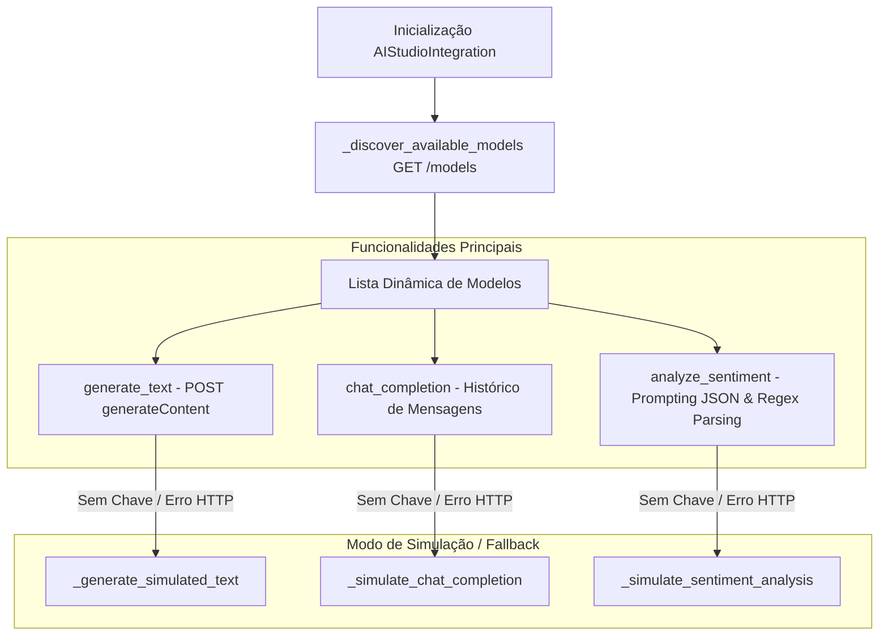

# Documentação Técnica: Integração REST Google AI Studio (`.kamila/llm/ai_studio_integration.py`)

Esta documentação descreve em detalhes o funcionamento do módulo **`ai_studio_integration.py`**, representado pela classe `AIStudioIntegration`. Este componente é responsável por estabelecer a comunicação direta via protocolo HTTP REST com a API v1beta do **Google AI Studio** (`generativelanguage.googleapis.com`), servindo como uma alternativa leve e nativa sem dependência estrita da SDK `google-generativeai`.

---

## 1. Visão Geral da Arquitetura

O `AIStudioIntegration` encapsula as chamadas de rede da biblioteca `requests` para requisições de modelos de linguagem, oferecendo autodescoberta de modelos, análise de sentimento estruturada em JSON e fallback sintético baseado em regras para execução offline.



---

## 2. Endpoints e Parâmetros da API

- **URL Base**: `https://generativelanguage.googleapis.com/v1beta`
- **Chave de Autenticação**: Carregada da variável de ambiente `GOOGLE_AI_API_KEY`.
- **Payload Padrão (`generateContent`)**:
  ```json
  {
    "contents": [{"parts": [{"text": "Prompt do usuário"}]}],
    "generationConfig": {
      "temperature": 0.7,
      "maxOutputTokens": 2048,
      "topK": 40,
      "topP": 0.95
    }
  }
  ```

---

## 3. Detalhamento dos Métodos da Classe `AIStudioIntegration`

### 3.1 Descoberta de Modelos (`_discover_available_models`)
- Executa requisição `GET` no endpoint `/models?key=GOOGLE_AI_API_KEY`.
- Mapeia a lista `data['models']` preenchendo o atributo `self.models_available` com os identificadores disponíveis na conta da Google.

---

### 3.2 Geração de Texto (`generate_text`)
```python
def generate_text(self, prompt: str, model: str = "gemini-pro",
                 temperature: float = 0.7, max_tokens: int = 2048) -> Optional[str]:
```
- Dispara requisição `POST` ao endpoint `/models/{model}:generateContent`.
- Processa o JSON de resposta para extrair o texto de `candidates[0]['content']['parts'][0]['text']`.
- Em caso de falha de conexão ou HTTP Error, aciona automaticamente a geração sintética `_generate_simulated_text(prompt)`.

---

### 3.3 Conclusão de Diálogo (`chat_completion`)
```python
def chat_completion(self, messages: List[Dict[str, str]],
                   model: str = "gemini-pro", temperature: float = 0.7) -> Optional[str]:
```
- Aceita um histórico de conversação estruturado no formato `[{"role": "user", "parts": [...]}]`.
- Retorna a resposta contínua da IA mantendo a coerência conversacional.

---

### 3.4 Análise de Sentimento NLU (`analyze_sentiment`)
```python
def analyze_sentiment(self, text: str) -> Dict[str, Any]:
```
- Executa um prompt instrucional exigindo que o modelo responda estritamente em formato JSON:
  ```json
  {"sentimento": "positivo/negativo/neutro", "confianca": 0.8, "emocoes": ["feliz"]}
  ```
- Aplica Expressão Regular (`re.search(r'\{.*\}', response)`) para extrair e converter a string no dicionário Python via `json.loads`.

---

### 3.5 Fallbacks Sintéticos e Testes (`_generate_simulated_*` & `test_integration`)
- Em ambientes sem chave de API ou conexão à internet, analisa palavras-chave (*"oi"*, *"hora"*, *"piada"*, *"ajuda"*) para fornecer respostas imediatas.
- O método `test_integration()` executa um ciclo completo de checagens para validação dos endpoints.
