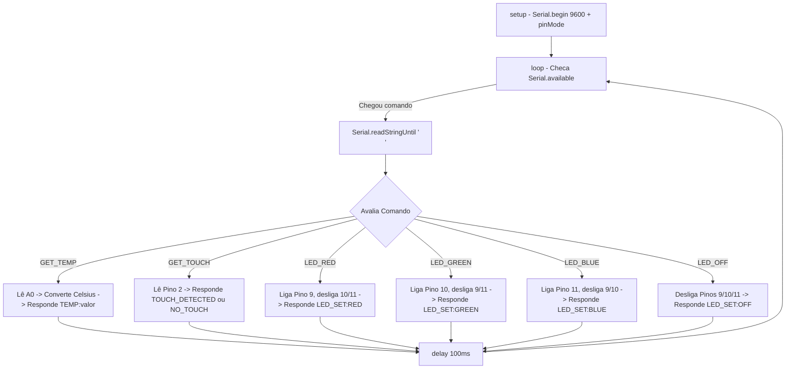

# Documentação Técnica: Firmware C++ Arduino (`hardware/kamila_avancada/arduino_sketch.ino`)

Esta documentação descreve detalhadamente o código-fonte do sketch C++ **`arduino_sketch.ino`**, localizado em `hardware/kamila_avancada/arduino_sketch.ino`. Este firmware roda no microcontrolador Arduino, permitindo a comunicação bi-direcional via porta serial USB com a assistente **Kamila**.

---

## 1. Código-Fonte Completo (`arduino_sketch.ino`)

```cpp
// Arduino sketch for Kamila hardware interface
// Connect sensors and LED to Arduino pins

#define TEMP_SENSOR A0
#define TOUCH_SENSOR 2
#define LED_RED 9
#define LED_GREEN 10
#define LED_BLUE 11

void setup() {
  Serial.begin(9600);
  pinMode(TOUCH_SENSOR, INPUT);
  pinMode(LED_RED, OUTPUT);
  pinMode(LED_GREEN, OUTPUT);
  pinMode(LED_BLUE, OUTPUT);
}

void loop() {
  if (Serial.available() > 0) {
    String command = Serial.readStringUntil('\n');
    command.trim();

    if (command == "GET_TEMP") {
      int tempValue = analogRead(TEMP_SENSOR);
      float temperature = tempValue * (5.0 / 1023.0) * 100;  // Simple conversion
      Serial.println("TEMP:" + String(temperature));
    } else if (command == "GET_TOUCH") {
      int touchValue = digitalRead(TOUCH_SENSOR);
      if (touchValue == HIGH) {
        Serial.println("TOUCH_DETECTED");
      } else {
        Serial.println("NO_TOUCH");
      }
    } else if (command.startsWith("LED_")) {
      String color = command.substring(4);
      if (color == "RED") {
        digitalWrite(LED_RED, HIGH);
        digitalWrite(LED_GREEN, LOW);
        digitalWrite(LED_BLUE, LOW);
      } else if (color == "GREEN") {
        digitalWrite(LED_RED, LOW);
        digitalWrite(LED_GREEN, HIGH);
        digitalWrite(LED_BLUE, LOW);
      } else if (color == "BLUE") {
        digitalWrite(LED_RED, LOW);
        digitalWrite(LED_GREEN, LOW);
        digitalWrite(LED_BLUE, HIGH);
      } else if (color == "OFF") {
        digitalWrite(LED_RED, LOW);
        digitalWrite(LED_GREEN, LOW);
        digitalWrite(LED_BLUE, LOW);
      }
      Serial.println("LED_SET:" + color);
    }
  }
  delay(100);
}
```

---

## 2. Detalhamento do Fluxo de Execução



---

## 3. Especificações das Funções e Leitura de Sensores

### 3.1 Conversão de Temperatura (`GET_TEMP`)
- A constante `5.0 / 1023.0` converte a leitura inteira de 10 bits (0 a 1023) da entrada analógica `A0` para a tensão correspondente em Volts (0V a 5V).
- O fator de multiplicação `* 100` converte a tensão em graus Celsius (padrão de saída do sensor LM35: $10\,mV/^\circ C$).

### 3.2 Sensor de Toque (`GET_TOUCH`)
- Lê o estado digital do pino `2` (`HIGH` ou `LOW`).
- Permite detectar pressionamentos de botão físico para ativar o reconhecimento por voz sem depender exclusivamente de wake word.

### 3.3 Indicador Visual RGB (`LED_<COR>`)
- Controla a iluminação periférica para sinalizar visualmente o status da assistente para o usuário em ambiente físico.
