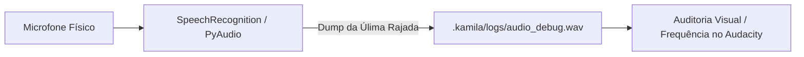

# Documentação Técnica: Arquivo de Depuração de Áudio (`.kamila/logs/audio_debug.wav`)

Esta documentação descreve a função, as especificações técnicas e a política de segurança do arquivo **`audio_debug.wav`**, localizado no caminho `.kamila/logs/audio_debug.wav`. Este arquivo é um **buffer binário temporário de áudio** gerado durante as rotinas de escuta do motor de Speech-to-Text (STT).

---

## 1. Visão Geral e Propósito

O `audio_debug.wav` permite aos desenvolvedores e mantenedores da assistente **Kamila** auditar a qualidade do sinal capturado pelo microfone físico em tempo real. Ele armazena o último trecho de voz capturado antes do envio para transcrição nas APIs de reconhecimento de fala.

---

## 2. Especificações Técnicas do Formato de Áudio

| Parâmetro | Valor | Descrição |
| :--- | :--- | :--- |
| **Formato de Contêiner** | `WAV (RIFF)` | Formato não comprimido padrão para alta fidelidade sonora. |
| **Taxa de Amostragem** | `16.000 Hz` (16 kHz) | Frequência recomendada para motores de STT e Porcupine. |
| **Número de Canais** | `1` (Mono) | Sinal de canal único para redução de processamento. |
| **Codificação / Bit Depth** | `16-bit PCM Signed` | Inteiros de 16 bits little-endian (S16LE). |

---

## 3. Casos de Uso para Diagnóstico de Problemas

O arquivo `audio_debug.wav` é utilizado para identificar:
1. **Gargalos de Microfone**: Ruídos de estática, eco ambiente ou clipping no sinal de entrada.
2. **Sensibilidade do Limiar (`energy_threshold`)**: Avaliar se o nível de energia do silêncio ambiente está acima ou abaixo do limiar estático (ex: 300 - 400).
3. **Cortes de Frase (`pause_threshold`)**: Verificar se o tempo de pausa (1.5s) está cortando palavras no final da frase do usuário.

---

## 4. Segurança e Privacidade de Dados

> [!CAUTION]
> **Privacidade do Usuário**: O arquivo `audio_debug.wav` contém amostras da voz real gravada do usuário. Portanto, ele é mantido estritamente no ambiente local e está **ignorado no Git** via `.gitignore` (`*.log`, buffers temporários).

**Nunca envie este arquivo de áudio para repositórios remotos ou servidores públicos.**
