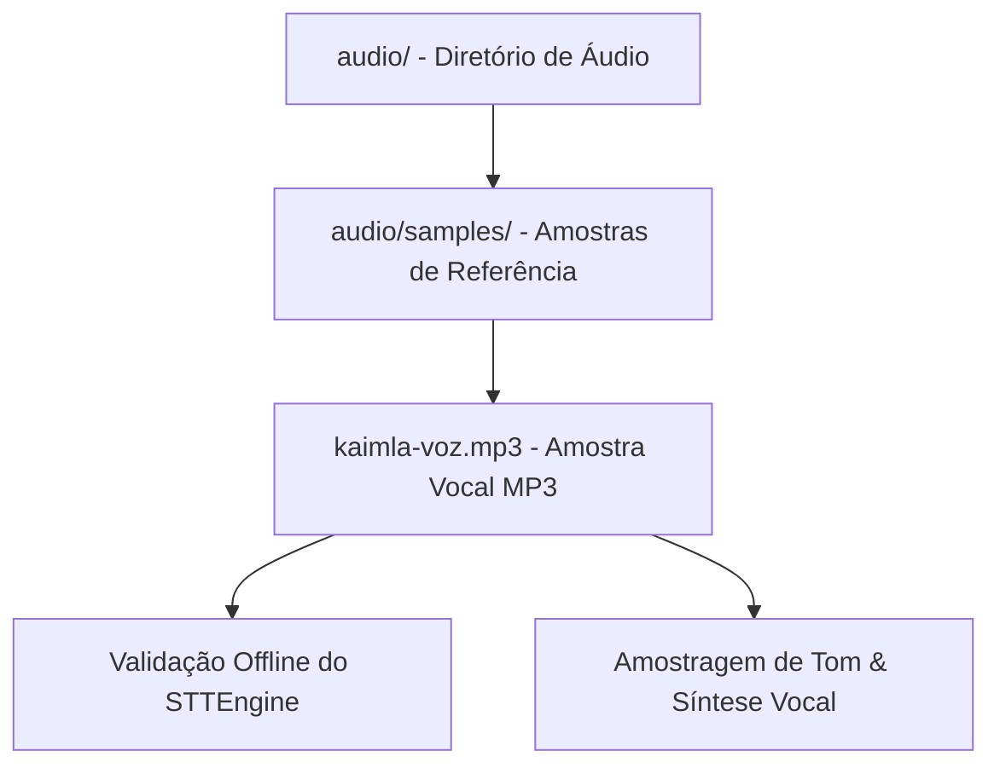

# Documentação Técnica: Diretório de Recursos de Áudio (`audio/`)

Esta documentação descreve a função, a estrutura e os casos de uso do diretório **`audio/`**, localizado na raiz do projeto `audio/`. Este diretório é dedicado ao armazenamento de **amostras sonoras, bancos de voz de referência e artefatos de teste** utilizados na calibração dos motores de fala (STT e TTS) da assistente **Kamila**.

---

## 1. Visão Geral da Arquitetura

O diretório `audio/` fornece ativos de áudio pré-gravados para testes de bancada (*benchmarking*), simulação offline de entrada de voz e validação da tonalidade da voz sintetizada.

---

## 2. Estrutura de Arquivos e Ativos

| Caminho do Arquivo | Formato | Tamanho | Propósito / Descrição |
| :--- | :--- | :--- | :--- |
| **`audio/samples/kaimla-voz.mp3`** | `MP3` | ~499 KB | Amostra de áudio de referência contendo a entonação da voz da Kamila. Utilizada para validação de tom e sintonia vocal. |

---

## 3. Principais Casos de Uso

1. **Testes de Integração Sem Microfone**: Permite alimentar o pipeline de reconhecimento de fala (`STTEngine`) com arquivos de áudio pré-gravados em ambientes automatizados de CI/CD ou servidores sem dispositivo de áudio físico.
2. **Calibração de Modelos TTS**: Fornece arquivos de áudio de alta fidelidade para ajuste fino (*fine-tuning*) e avaliação perceptual da qualidade da voz sintetizada.
3. **Efeitos Sonoros de Sistema**: Reserva para futuros efeitos sonoros de confirmação (*beeps*, *chimes* de ativação da palavra-chave *"kamila"*).
