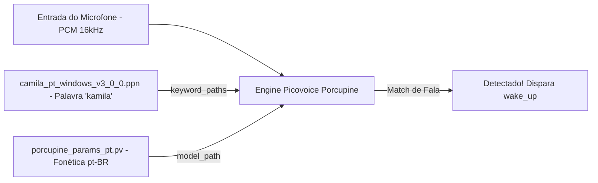

# Documentação Técnica: Binário de Palavra de Ativação (`models/wake_words/camila_pt_windows_v3_0_0.ppn`)

Esta documentação descreve as especificações técnicas, a estrutura e o papel do arquivo binário **`camila_pt_windows_v3_0_0.ppn`**, localizado em `models/wake_words/camila_pt_windows_v3_0_0.ppn`. Este ativo é o **modelo compilado de acionamento por voz (Wake Word)** customizado para a palavra *"Kamila"* no sistema operacional Windows.

---

## 1. Visão Geral e Ficha Técnica

O `camila_pt_windows_v3_0_0.ppn` é um binário treinado através da plataforma Picovoice Console. Ele contém os padrões acústicos fonéticos que ativam a assistente quando o usuário pronuncia a palavra *"Kamila"* ou *"Camila"*.



---

## 2. Especificações do Modelo Binário

| Parâmetro | Valor |
| :--- | :--- |
| **Caminho Relativo** | `models/wake_words/camila_pt_windows_v3_0_0.ppn` |
| **Tipo de Arquivo** | Binário Proprietário Picovoice Keyword (`.ppn`) |
| **Tamanho Exato** | `2.744 bytes` (~2.7 KB) |
| **Palavra Mapeada** | `"camila"` / `"kamila"` |
| **Idioma Target** | Português do Brasil (`pt-BR`) |
| **Sistema Operacional Target**| Windows (`x86_64`) |
| **Versão da Engine** | Picovoice Porcupine v3.0.0 |
| **Sensibilidade Padrão** | `0.5` (Configurável no STTEngine de 0.0 a 1.0) |

---

## 3. Inicialização no Código Python

No módulo `core.stt_engine` (`.kamila/core/stt_engine.py`), este binário é referenciado através da lista `keyword_paths`:

```python
self.porcupine = pvporcupine.create(
    access_key=self.picovoice_api_key,
    keyword_paths=['models/wake_words/camila_pt_windows_v3_0_0.ppn'],
    model_path='models/porcupine_models/porcupine_params_pt.pv',
    sensitivities=[0.5]
)
```

---

## 4. Vantagens do Modelo Customizado

1. **Baixíssimo Consumo**: Ocupa insignificantes 2.7 KB de armazenamento e menos de 5 KB de RAM no buffer de palavras-chave.
2. **Desempenho Sem Latência**: Responde em milissegundos ao ouvir a palavra *"kamila"*.
3. **Privacidade Preservada**: Nenhuma gravação de áudio é transmitida pela rede para detecção da palavra de ativação.
