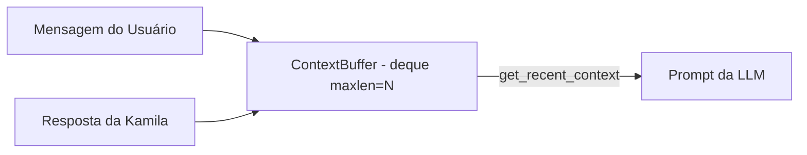

# Documentação Técnica: Buffer de Contexto (`.kamila/core/context_buffer.py`)

Esta documentação descreve em detalhes o funcionamento do módulo **`context_buffer.py`**, representado pela classe `ContextBuffer`. Este componente é responsável por gerenciar a **memória de curto prazo** da assistente **Kamila**, mantendo o histórico recente das conversas em um buffer de janela deslizante (*sliding window*).

---

## 1. Visão Geral da Arquitetura

O `ContextBuffer` garante que a assistente mantenha a fluidez e a coerência do diálogo durante uma sessão de conversa, fornecendo o histórico recente das interações para a construção do prompt enviado ao Modelo de Linguagem (Gemini LLM).



---

## 2. Estrutura de Dados e Métodos

### 2.1 Estrutura de Dados Utilizada
O módulo utiliza a coleção nativa **`collections.deque`** com o parâmetro `maxlen`. 
- **Vantagem de Desempenho**: A inserção e o descarte de elementos em uma fila circular de tamanho fixo possuem complexidade de tempo constante $O(1)$. Quando a capacidade máxima é atingida, a interação mais antiga é descartada automaticamente sem necessidade de deslocamento de índices em memória.

---

### 2.2 Detalhamento dos Métodos

#### `__init__(size: int = 10)`
```python
def __init__(self, size: int = 10):
    self.buffer = deque(maxlen=size)
```
- **Descrição**: Inicializa o buffer com a capacidade máxima informada.
- **Uso no Projeto**: Na classe `MemoryManager`, a capacidade padrão definida é de 8 interações (`size=8`).

---

#### `add_interaction(user_input: str, assistant_response: str)`
```python
def add_interaction(self, user_input: str, assistant_response: str):
```
- **Descrição**: Empacota uma troca de mensagens em um dicionário estruturado `{"user": user_input, "assistant": assistant_response}` e a adiciona ao final do buffer.

---

#### `get_recent_context() -> str`
```python
def get_recent_context(self) -> str:
```
- **Descrição**: Itera sobre todas as interações contidas no buffer e gera um texto formatado em linhas prontas para inclusão direta no prompt da IA.
- **Retorno de Exemplo**:
  ```text
  Usuário: Olá Kamila, tudo bem?
  Kamila: Olá! Tudo ótimo por aqui. Como posso te ajudar hoje?
  Usuário: O que você pode fazer?
  Kamila: Posso te ajudar com tarefas do dia a dia, lembretes e saúde!
  ```
- **Caso de Buffer Vazio**: Retorna a string `"Nenhuma conversa recente."`.

---

#### `clear()`
```python
def clear(self):
    self.buffer.clear()
```
- **Descrição**: Esvazia completamente o buffer de contexto da conversa ativa.

---

## 3. Resumo da Integração

| Atributo / Método | Função no Sistema |
| :--- | :--- |
| `self.buffer` | Objeto `deque` que armazena os pares de conversa da sessão. |
| `add_interaction` | Invocado por `MemoryManager.process_interaction` a cada turno de diálogo. |
| `get_recent_context` | Invocado por `MemoryManager._build_prompt` para contextualizar a LLM. |
| `clear` | Invocado por rotinas de privacidade ou reinicialização de sessão. |
