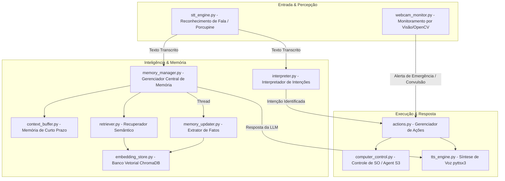

# Documentação Técnica: Núcleo do Sistema (`.kamila/core`)

Esta documentação fornece uma análise detalhada dos módulos que constituem o **núcleo funcional (Core)** da assistente **Kamila**. O diretório `.kamila/core` abriga os motores de memória, síntese/reconhecimento de voz, visão computacional, interpretação de intenções, controle de sistema e automação do computador.

---

## 1. Visão Geral da Arquitetura do Núcleo

A arquitetura interna do núcleo é modular e orientada a eventos/intenções:

---

## 2. Detalhamento dos Módulos do Núcleo

### 2.1 `memory_manager.py` (`MemoryManager`)
- **Descrição**: Orquestrador central de todo o sistema de memória. Unifica o buffer de conversa em tempo real com o banco vetorial de longo prazo.
- **Principais Componentes Internos**:
  - `ContextBuffer`: Mantém as últimas 8 interações em memória de curto prazo.
  - `EmbeddingStore`: Armazena fatos e episódios como embeddings vetoriais no ChromaDB.
  - `Retriever`: Recupera memórias passadas semanticamente relevantes para a conversa atual.
  - `MemoryUpdater`: Detecta fatos automaticamente (ex: nome, gostos, preferências) e salva em background via thread dedicada.
- **Métodos Chave**:
  - `process_interaction(user_input)`: Monta o prompt contextualizado com memórias relevantes + conversa recente, consulta a LLM Gemini, adiciona a resposta ao buffer e dispara a extração de fatos assíncrona.
  - `add_health_event(event_type, details)`: Registra episódios e alertas de saúde no banco vetorial e no contexto imediato.

---

### 2.2 `context_buffer.py` (`ContextBuffer`)
- **Descrição**: Gerencia a memória de curto prazo (*sliding window*) utilizando uma fila de tamanho fixo (`collections.deque`).
- **Capacidade Padrão**: 8 a 10 interações.
- **Funções**:
  - `add_interaction(user_input, assistant_response)`: Insere o par de conversa na fila.
  - `get_recent_context()`: Formata o histórico recente para inclusão no prompt da IA.
  - `clear()`: Esvazia o buffer de conversa.

---

### 2.3 `embedding_store.py` (`EmbeddingStore`)
- **Descrição**: Camada de persistência vetorial baseada em **ChromaDB** (`PersistentClient`). Armazena memórias no diretório local `.kamila/kamila_memory_db`.
- **Integração**: Utiliza a classe `LLMInterface` para gerar embeddings vetoriais das frases do usuário.
- **Funções**:
  - `add_memory(text, metadata)`: Salva uma frase individual com timestamp e metadados.
  - `add_memories(texts, metadatas)`: Inserção em lote (*batch insertion*) para múltiplos fatos.
  - `search_memories(query_text, n_results=3)`: Executa busca por similaridade vetorial (Cosseno / Distância) retornando as memórias mais próximas.

---

### 2.4 `retriever.py` (`Retriever`)
- **Descrição**: Módulo auxiliar de consulta semântica responsável por extrair do `EmbeddingStore` as memórias contextuais que combinam com a pergunta ou frase atual do usuário.
- **Funções**:
  - `retrieve_relevant_memories(current_input, n_memories=3)`: Retorna os textos de memória mais relevantes para enriquecer o prompt da IA.

---

### 2.5 `memory_updater.py` (`MemoryUpdater`)
- **Descrição**: Mecanismo de aprendizado contínuo. Analisa a entrada do usuário através de expressões regulares (Regex) para identificar fatos pessoais sem necessidade de comandos explícitos.
- **Padrões de Fatos Identificados**:
  - Nome do usuário (*"meu nome é...", "pode me chamar de..."*).
  - Preferências positivas (*"eu gosto de...", "adoro..."*).
  - Preferências negativas (*"eu odeio...", "não gosto de..."*).
- **Funções**:
  - `process_and_save_facts(user_input)`: Extrai os fatos encontrados e os salva no `EmbeddingStore`.

---

### 2.6 `interpreter.py` (`CommandInterpreter`)
- **Descrição**: Motor de interpretação de linguagem natural baseado em regras e padrões Regex para mapeamento rápido de intenções.
- **Principais Intenções Mapeadas**:
  - **Sistema/Social**: `greeting`, `goodbye`, `time`, `date`, `weather`, `help`, `status`.
  - **Saúde e Emergência**: `start_monitoring`, `stop_monitoring`, `health_protocol`, `dim_lights`, `lower_volume`, `emergency_contact`, `record_crisis`, `daily_checkin`, `medication_reminder`.
  - **Controle de Dispositivos e Mídia**: `lights`, `volume`, `music`, `camera_monitor`.
  - **Automação de PC**: `execute_on_pc` (abrir aplicativos, clicar, navegar).
- **Cálculo de Confiança**: Utiliza a função `_calculate_confidence()` para determinar o grau de correspondência entre o texto e as intenções (com limiar padrão de 0.7).

---

### 2.7 `actions.py` (`ActionManager`)
- **Descrição**: Gerenciador e executor de ações do sistema. Traduz as intenções geradas pelo `CommandInterpreter` em execuções práticas.
- **Ações Executadas**:
  - Controle de volume e brilho do sistema para protocolos de conforto em crises.
  - Notificação de emergência e ativação do protocolo de saúde.
  - Captura de fotos via webcam.
  - Execução de comandos do sistema operacional (abrir navegadores, tocar música).
  - Delegação de comandos avançados de computador ao módulo `ComputerControl`.

---

### 2.8 `computer_control.py` (`ComputerControl`)
- **Descrição**: Interface de controle autônomo do computador que atua como os "braços e pernas" virtuais da Kamila.
- **Tecnologia**: Baseado no ecossistema **Agent S3** (`gui_agents.s3`) e `pyautogui`.
- **Funcionamento**:
  - Captura *screenshots* da tela do Windows.
  - Utiliza modelos visuais/grounding (`OSWorldACI`) para mapear instruções em linguagem natural (ex: *"abrir o bloco de notas"*) em coordenadas de clique e digitação na interface gráfica.

---

### 2.9 `stt_engine.py` (`STTEngine`)
- **Descrição**: Motor de reconhecimento de fala (Speech-to-Text).
- **Recursos**:
  - **Wake Word**: Integração com **Picovoice Porcupine** para escuta contínua ultra-rápida da palavra-chave *"Kamila"*.
  - **Transcrição**: Utiliza a biblioteca `SpeechRecognition` com fallback dinâmico e calibração de ruído de fundo via PyAudio.
- **Variantes no Diretório**:
  - `stt_engine_google.py`: Versão dedicada ao Google Speech API.
  - `stt_engine_fixed.py` / `stt_engine_corrected.py`: Versões legadas de ajuste e compatibilidade.

---

### 2.10 `tts_engine.py` (`TTSEngine`)
- **Descrição**: Motor de síntese de voz (Text-to-Speech) construído sobre `pyttsx3`.
- **Recursos**:
  - Seleção automática de voz nativa em Português do Brasil (`pt-BR`).
  - Sanitização de texto (`_sanitize_text`): Remove emojis e caracteres especiais que travam sínteses de voz nativas.
  - Suporte a execução síncrona (`speak`) e assíncrona (`speak_async`).

---

### 2.11 `webcam_monitor.py` (`WebcamMonitor`)
- **Descrição**: Sistema de visão computacional para monitoramento preventivo de saúde e emergências médicas via webcam.
- **Tecnologia**: **OpenCV** e **MediaPipe** (Face Mesh).
- **Alertas e Detecções**:
  - **Detecção de Convulsão/Tremores**: Análise de variação de movimento rápido entre frames consecutivos via subtrator de fundo (`BackgroundSubtractorMOG2`).
  - **Detecção de Quedas**: Monitoramento da posição e proporção do corpo no enquadramento da tela.
  - **Análise de Piscadas (Blink Ratio)**: Análise do formato dos olhos via MediaPipe para identificar piscadas anormais (>3 piscadas/segundo).
- **Ações de Emergência**: Dispara avisos de áudio pelo `TTSEngine` e ativa automaticamente o protocolo de saúde em `ActionManager`.

---

## 3. Resumo dos Componentes

| Módulo | Função Principal | Tecnologias Utilizadas |
| :--- | :--- | :--- |
| `memory_manager.py` | Orquestração da memória | Python Threading, Gemini API |
| `context_buffer.py` | Memória de conversa recente | `collections.deque` |
| `embedding_store.py` | Persistência vetorial de fatos | ChromaDB, Embeddings |
| `retriever.py` | Busca por relevância semântica | ChromaDB Query |
| `memory_updater.py` | Aprendizado e extração de fatos | Regex, Pattern Matching |
| `interpreter.py` | Mapeamento de intenções | Regex, Match Confidence |
| `actions.py` | Execução de ações de sistema/saúde | Subprocess, Webbrowser |
| `computer_control.py` | Automação de interface do SO | Agent S3, PyAutoGUI, PIL |
| `stt_engine.py` | Captura de voz e Wake Word | SpeechRecognition, Porcupine, PyAudio |
| `tts_engine.py` | Fazer a assistente falar | `pyttsx3` |
| `webcam_monitor.py` | Detecção de convulsões e quedas | OpenCV, MediaPipe |
