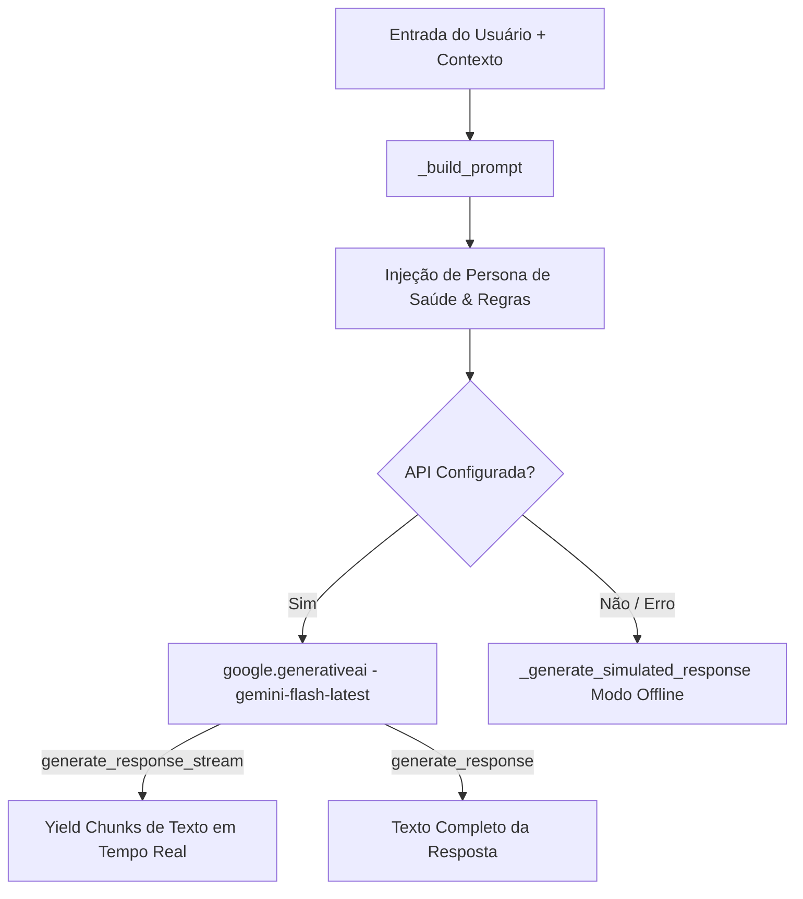

# Documentação Técnica: Motor Conversacional Gemini (`.kamila/llm/gemini_engine.py`)

Esta documentação descreve em detalhes o funcionamento do módulo **`gemini_engine.py`**, representado pela classe `GeminiEngine`. Este componente é o **motor primário de inteligência artificial generativa** da assistente **Kamila**, conectando-se ao **Google Gemini AI** via SDK oficial `google.generativeai`.

---

## 1. Visão Geral da Arquitetura

O `GeminiEngine` gerencia a personalidade empática da assistente Kamila, aplicando injeção de contexto de saúde (apoio a epilepsia), respostas por streaming em tempo real e filtros estritos de segurança.



---

## 2. Configuração do Modelo e Diretivas de Segurança

- **Modelo Padrão**: `gemini-flash-latest` (otimizado para resposta ultra-rápida).
- **Chave de API**: Carregada da variável de ambiente `GOOGLE_AI_API_KEY`.
- **Hiperparâmetros (`GenerationConfig`)**:
  - `temperature`: `0.7`
  - `top_k`: `40`
  - `top_p`: `0.95`
  - `max_output_tokens`: `2048`
- **Filtros de Segurança (`SafetySettings`)**:
  - `HARM_CATEGORY_HARASSMENT`: `BLOCK_MEDIUM_AND_ABOVE`
  - `HARM_CATEGORY_HATE_SPEECH`: `BLOCK_MEDIUM_AND_ABOVE`
  - `HARM_CATEGORY_SEXUALLY_EXPLICIT`: `BLOCK_MEDIUM_AND_ABOVE`
  - `HARM_CATEGORY_DANGEROUS_CONTENT`: `BLOCK_MEDIUM_AND_ABOVE`

---

## 3. Persona da Assistente e Construção de Prompt (`_build_prompt`)

O método `_build_prompt` constrói as diretivas de sistema da assistente **Kamila**:
- **Personalidade**: Assistente virtual e companheira de saúde dedicada ao apoio de pessoas com epilepsia. Acolhedora, empática, paciente e vigilante ("Estou aqui cuidando de você").
- **Adaptação Dinâmica ao Contexto**:
  - `user_name`: Personalização pelo nome do usuário.
  - `current_time`: Ajusta o tom de energia para manhã, tarde ou noite.
  - `user_mood`: Adapta a resposta conforme o estado de humor do usuário (`feliz`, `triste`, `irritado`, `curioso`).
  - `conversation_history`: Injeta os últimos 5 turnos de diálogo para manter a continuidade do assunto.

---

## 4. Detalhamento dos Métodos da Classe `GeminiEngine`

### 4.1 Respostas por Streaming (`generate_response_stream`)
```python
def generate_response_stream(self, prompt: str, context: Optional[Dict[str, Any]] = None):
```
- Invoca `model.generate_content(full_prompt, stream=True, ...)`.
- Utiliza a sintaxe `yield` do Python para transmitir cada bloco de texto (*chunk*) assim que ele é recebido da nuvem do Google, permitindo síntese de fala e exibição imediata na tela.

---

### 4.2 Resposta Síncrona em Bloco (`generate_response` / `chat`)
```python
def generate_response(self, prompt: str, context: Optional[Dict[str, Any]] = None) -> str:
```
- Retorna o texto completo da resposta gerada em uma única string.

---

### 4.3 Modo de Simulação Offline (`_generate_simulated_response`)
- Fornece respostas baseadas em heurísticas e palavras-chave para comandos comuns (*"oi"*, *"hora"*, *"piada"*) caso a chave de API não esteja disponível ou a biblioteca `google-generativeai` não esteja instalada no ambiente.

---

### 4.4 Utilitários de Diagnóstico (`get_model_info` / `test_gemini`)
- `get_model_info()`: Retorna o status da conexão, se o modelo está ativo e a contagem do histórico.
- `test_gemini()`: Executa casos de teste simples de conversação e gera registros nos logs do sistema.
