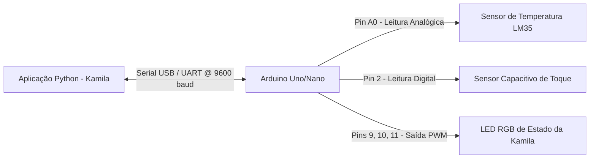

# Documentação Técnica: Módulo de Integração com Hardware (`hardware/`)

Esta documentação descreve o funcionamento, os esquemas de pinagem e o protocolo de comunicação do diretório **`hardware/`** e do firmware C++ **`arduino_sketch.ino`**, localizado em `hardware/kamila_avancada/arduino_sketch.ino`. Este componente permite que a assistente **Kamila** interaja com microcontroladores (Arduino Uno / Nano / ESP32) para **leitura de sensores ambientais e feedback visual via LED RGB**.

---

## 1. Visão Geral da Arquitetura

O firmware estabelece uma ponte de comunicação Serial UART (`9600 baud`) entre a aplicação Python da Kamila (rodando no computador) e o microcontrolador Arduino.

---

## 2. Eschema de Mapeamento de Pinos (Pinout)

| Componente | Pino do Arduino | Tipo de Sinal | Descrição |
| :--- | :--- | :--- | :--- |
| **Sensor de Temperatura** | `A0` | Entrada Analógica | Conectado ao pino Vout do sensor analógico (LM35). |
| **Sensor de Toque** | `Pin 2` | Entrada Digital (`INPUT`) | Sensor capacitivo para acionamento por botão físico. |
| **LED RGB - Vermelho** | `Pin 9` | Saída Digital (`OUTPUT`) | Indica estado de processamento/gravação. |
| **LED RGB - Verde** | `Pin 10` | Saída Digital (`OUTPUT`) | Indica que a assistente está acordada e pronta. |
| **LED RGB - Azul** | `Pin 11` | Saída Digital (`OUTPUT`) | Indica conexão ou modo de escuta ativa. |

---

## 3. Protocolo de Comandos Serial (UART)

A Kamila envia comandos no formato string terminados em caractere de nova linha (`\n`):

### 3.1 Consulta de Temperatura (`GET_TEMP`)
- **Comando Enviado pelo Python**: `GET_TEMP\n`
- **Cálculo no Arduino**: `temperature = tempValue * (5.0 / 1023.0) * 100`
- **Resposta do Arduino**: `TEMP:24.50`

### 3.2 Consulta do Sensor de Toque (`GET_TOUCH`)
- **Comando Enviado pelo Python**: `GET_TOUCH\n`
- **Resposta se Pressionado**: `TOUCH_DETECTED`
- **Resposta se Repouso**: `NO_TOUCH`

### 3.3 Controle de Cores do LED RGB (`LED_<COR>`)
- **`LED_RED`**: Ativa o pino 9 (Vermelho) e apaga os demais. Responde `LED_SET:RED`.
- **`LED_GREEN`**: Ativa o pino 10 (Verde) e apaga os demais. Responde `LED_SET:GREEN`.
- **`LED_BLUE`**: Ativa o pino 11 (Azul) e apaga os demais. Responde `LED_SET:BLUE`.
- **`LED_OFF`**: Desliga todos os pinos do LED. Responde `LED_SET:OFF`.
