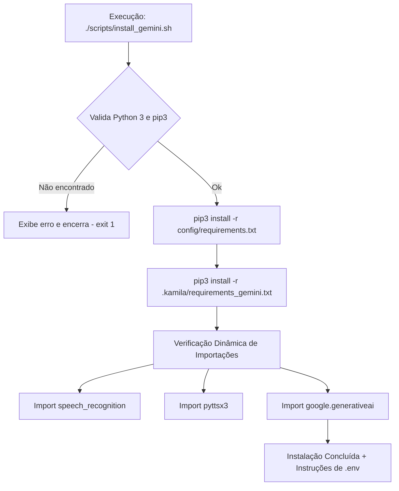

# Documentação Técnica: Script de Instalação dos Módulos Gemini (`scripts/install_gemini.sh`)

Esta documentação descreve as etapas, o funcionamento e as verificações executadas pelo script Bash **`install_gemini.sh`**, localizado no caminho `scripts/install_gemini.sh`. Este utilitário automatiza o provisionamento das bibliotecas de IA generativa do **Google Gemini** e executa testes de validação de ambiente.

---

## 1. Visão Geral do Pipeline de Instalação

O `install_gemini.sh` valida a presença do Python 3 e pip3 no sistema, instala o conjunto de requisitos básicos e o arquivo de dependências do Gemini, finalizando com verificações dinâmicas de importação via trechos em Python.



---

## 2. Como Executar o Script

No terminal Linux, torne o script executável e execute:

```bash
chmod +x scripts/install_gemini.sh
./scripts/install_gemini.sh
```

---

## 3. Detalhamento das Etapas do Script

### 3.1 Verificação de Requisitos do Sistema
```bash
if ! command -v python3 &> /dev/null; then exit 1; fi
if ! command -v pip3 &> /dev/null; then exit 1; fi
```
Garante que o interpretador Python 3 e o gerenciador de pacotes `pip3` estão presentes no `$PATH` do sistema operacional.

---

### 3.2 Instalação de Dependências de Pacotes
```bash
pip3 install -r config/requirements.txt
pip3 install -r .kamila/requirements_gemini.txt
```
- Instala a pilha de entrada/saída de voz (`speech_recognition`, `pyttsx3`, `PyAudio`).
- Instala a pilha de IA generativa e NLU (`google-generativeai`, `google-ai-generativelanguage`, `transformers`, `torch`, `spacy`, `nltk`).

---

### 3.3 Verificação de Diagnóstico e Saúde dos Módulos
O script executa um comando inline Python (`python3 -c "..."`) testando a capacidade de importação das bibliotecas chave:
- **`speech_recognition`**: Valida a captura de áudio.
- **`pyttsx3`**: Valida o sintetizador de fala nativo.
- **`google.generativeai`**: Valida o SDK do Gemini. Se o pacote falhar, o script exibe aviso que o modo de simulação offline continuará operacional.

---

## 4. Instruções Finais de Configuração

Ao final da execução, o script indica as próximas ações recomendadas:
1. Configurar as chaves `GOOGLE_AI_API_KEY` e `PICOVOICE_API_KEY` em `.kamila/.env`.
2. Executar o teste dos módulos de IA: `python .kamila/test_gemini_modules.py`.
3. Disparar a assistente com suporte a LLM: `python .kamila/main_with_gemini.py`.
