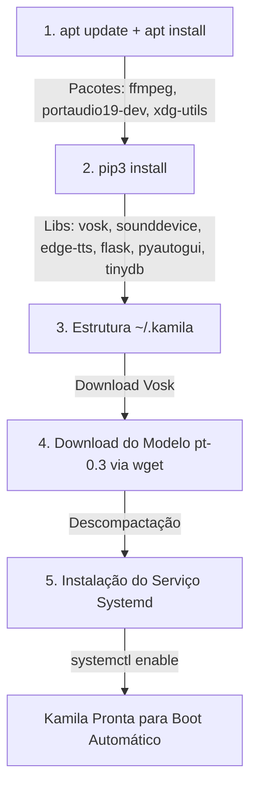

# Documentação Técnica: Script de Instalação Automática (`deployment/install_kamila.sh`)

Esta documentação descreve em detalhes o funcionamento do script Bash **`install_kamila.sh`**, localizado no diretório `deployment/install_kamila.sh`. Este script automatiza o provisionamento, a instalação de dependências do sistema operacional Linux (Debian/Ubuntu), o download do modelo offline de voz Vosk e a configuração do serviço de segundo plano `systemd`.

---

## 1. Visão Geral do Pipeline de Instalação

O script executa 4 etapas sequenciais até habilitar a inicialização automática da Kamila junto com o sistema operacional:



---

## 2. Como Executar a Instalação

Conceda permissão de execução ao script e execute com privilégios de administrador:

```bash
chmod +x deployment/install_kamila.sh
./deployment/install_kamila.sh
```

---

## 3. Detalhamento das Etapas do Script

### 3.1 Instalação de Pacotes do Sistema (`apt` e `pip3`)
```bash
sudo apt update
sudo apt install -y python3-pip ffmpeg portaudio19-dev unzip wget xdg-utils
pip3 install vosk sounddevice edge-tts flask pyautogui tinydb
```
- **`ffmpeg` & `portaudio19-dev`**: Suporte para captura de áudio PCM e síntese via alto-falantes.
- **`vosk`**: Motor de reconhecimento de fala offline.
- **`edge-tts`**: Síntese vocal de alta fidelidade via Microsoft Edge TTS API.
- **`flask`**: Servidor Web REST para gatilhos do sistema operacional.
- **`pyautogui`**: Controle de computador (mouse/teclado).

---

### 3.2 Estruturação do Ambiente (`~/.kamila`)
```bash
mkdir -p ~/.kamila
cp -r .kamila/* ~/.kamila/
```
Cria o diretório oculto na pasta do usuário `~/.kamila` e copia todos os módulos core e arquivos de configuração.

---

### 3.3 Download do Modelo de Reconhecimento Offline Vosk
```bash
mkdir -p ~/.kamila/modelos
cd ~/.kamila/modelos
wget -q https://alphacephei.com/vosk/models/vosk-model-small-pt-0.3.zip
unzip -o vosk-model-small-pt-0.3.zip
mv vosk-model-small-pt-0.3 pt
```
Baixa o modelo leve oficial em Português do Brasil `vosk-model-small-pt-0.3` (~45 MB), descompactando-o no diretório `~/.kamila/modelos/pt`.

---

### 3.4 Instalação e Ativação do Serviço `systemd`
```bash
sudo cp deployment/systemd/kamila.service /etc/systemd/system/kamila.service
sudo systemctl daemon-reexec
sudo systemctl daemon-reload
sudo systemctl enable kamila.service
```
Copia a unidade de serviço `kamila.service` para `/etc/systemd/system/`, recarrega as configurações do gerenciador de serviços do Linux e habilita a Kamila para iniciar automaticamente durante o boot do computador.

---

## 4. Comandos de Operação Pós-Instalação

- **Iniciar o Serviço**: `sudo systemctl start kamila`
- **Parar o Serviço**: `sudo systemctl stop kamila`
- **Verificar Status**: `sudo systemctl status kamila`
- **Ver Logs em Tempo Real**: `journalctl -fu kamila`
