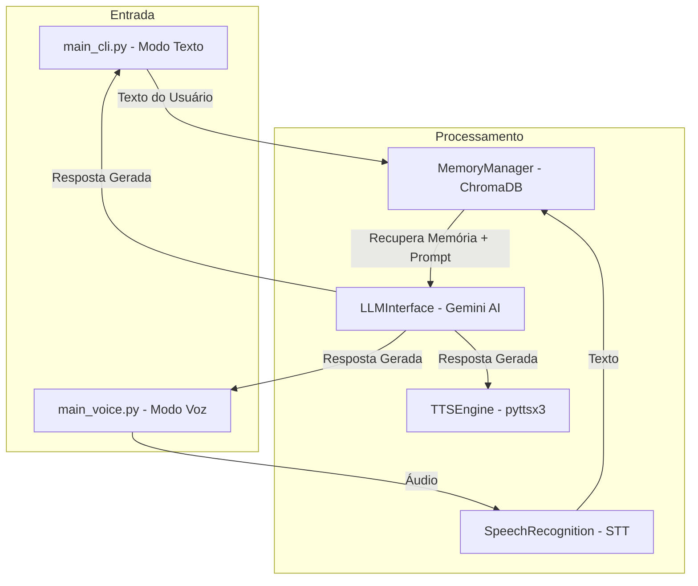

# Documentação Técnica: Interfaces de Entrada (`main_cli.py` e `main_voice.py`)

Esta documentação detalha o funcionamento, arquitetura, fluxos e responsabilidades dos dois pontos de entrada (entry points) do projeto **Kamila Assistant**.

---

## 1. Visão Geral da Arquitetura

O projeto Kamila possui duas interfaces principais para interação com o usuário:
- **`main_cli.py`**: Interface baseada em texto (CLI - *Command Line Interface*).
- **`main_voice.py`**: Interface *Voice-First* baseada em escuta ativa contínua via microfone (STT + TTS).

Ambas compartilham o mesmo "Cérebro" de IA e sistema de memória persistente (`MemoryManager`, `LLMInterface` e `TTSEngine`).

---

## 2. Documentação do `main_cli.py`

### 2.1 Descrição
O `main_cli.py` oferece um terminal interativo onde o usuário digita mensagens em formato de texto. É ideal para uso silencioso, desenvolvimento, depuração e gerenciamento direto da assistente.

### 2.2 Principais Funções

#### `setup_paths()`
- **Objetivo**: Configura os caminhos no `sys.path` incluindo o diretório raiz do projeto e a pasta `.kamila`.
- **Retorno**: Caminho absoluto da raiz do projeto (`project_root`).

#### `print_kamila(text)`
- **Objetivo**: Formata e exibe a resposta de texto no terminal com prefixo visual (`👩‍💻 Kamila: ...`).

#### `speak_kamila(tts_engine, text)`
- **Objetivo**: Executa a resposta por síntese de voz (`pyttsx3`) caso a variável global `VOICE_ENABLED` esteja como `True`.

#### `main()`
- **Objetivo**: Função principal que orquestra a inicialização e o loop infinito de entrada/saída.
- **Fluxo de Execução**:
  1. Carrega variáveis de ambiente via `dotenv`.
  2. Importa `LLMInterface`, `MemoryManager` e `TTSEngine`.
  3. Inicializa o banco vetorial ChromaDB e o modelo LLM (Gemini).
  4. Entra no loop `while True` aguardando a entrada do usuário (`input("👤 Você: ")`).
  5. Processa comandos de sistema ou envia ao `MemoryManager`.

#### `handle_diary(memory_manager, tts_engine)`
- **Objetivo**: Fluxo guiado interativo para registro diário de reflexões.
- **Perguntas realizadas**:
  1. *"O que você fez de mais importante hoje?"*
  2. *"O que você aprendeu ou poderia ter feito melhor?"*
  3. *"Como você se sentiu na maior parte do dia?"*
- **Armazenamento**: Consolida as respostas e grava no ChromaDB com a tag `{"type": "diary_entry"}`.

### 2.3 Comandos Específicos Suportados no CLI

| Comando | Ação |
| :--- | :--- |
| `sair`, `tchau`, `encerrar`, `quit`, `exit` | Encerra a aplicação graciosamente. |
| `limpar` | Limpa a tela da linha de comando (`cls` / `clear`). |
| `registra meu dia` / `registrar meu dia` | Inicia o fluxo de perguntas do diário (`handle_diary`). |
| `novo hábito: <nome>` | Cadastra um novo hábito na memória com a tag `habit_definition`. |
| `fiz <hábito>` / `concluí <hábito>` | Registra a conclusão de um hábito na memória. |
| `lembrar de <texto>` / `me lembra de <texto>` | Armazena um lembrete com a tag `reminder`. |

---

## 3. Documentação do `main_voice.py`

### 3.1 Descrição
O `main_voice.py` opera em modo de **escuta ativa contínua** (*Voice-First*). Ele capta o áudio do ambiente via microfone, detecta a palavra de ativação (*Wake Word*: **"Kamila"**), transcreve o áudio para texto, processa no cérebro de IA e responde falando em voz alta.

### 3.2 Principais Funções

#### `setup_paths()`
- **Objetivo**: Garante o correto encadeamento de diretórios para importação dos módulos internos.

#### `main()`
- **Objetivo**: Ponto de entrada do modo voz.
- **Fluxo de Inicialização**:
  1. Carrega configurações do `.env`.
  2. Calibra o ruído ambiente do microfone (`recognizer.adjust_for_ambient_noise`) por 2 segundos.
  3. Emitirá aviso sonoro: *"Estou ouvindo. Pode me chamar."*
- **Loop de Escuta Contínua**:
  1. `recognizer.listen()` capta blocos de áudio de até 5 segundos.
  2. Envia para o serviço Google Speech-to-Text (`recognize_google`) em Português (`pt-BR`).
  3. Verifica se a transcrição contém a palavra-chave (`"kamila"` ou `"camila"`).
  4. Extrai o comando. Se o usuário apenas disser "Kamila", ela responde *"Sim?"* e aguarda o comando por 10 segundos adicionais.
  5. Se o comando contiver rotinas específicas (Diário/Hábitos), processa via Regex. Caso contrário, consulta o `MemoryManager` + `LLMInterface`.
  6. Sintetiza a resposta em voz alta (`tts.speak`).

#### `log_diary(memory_manager, tts, recognizer, mic)`
- **Objetivo**: Conduz o fluxo do diário inteiramente por voz (sem teclado).

#### `listen_for_answer(recognizer, mic)`
- **Objetivo**: Função auxiliar para escutar a resposta oral do usuário com limite de até 15 segundos.

---

## 4. Variáveis de Ambiente Relevantes (`.env`)

| Variável | Descrição |
| :--- | :--- |
| `GOOGLE_AI_API_KEY` | Chave de API do Google Gemini (usada para raciocínio da IA). |
| `GOOGLE_SPEECH_API_KEY` | (Opcional) Chave da API Speech-to-Text caso queira cota própria do Google Cloud. |
| `VOICE_RATE` | Velocidade da síntese de voz (padrão: `180`). |
| `VOICE_VOLUME` | Volume do áudio sintetizado (padrão: `0.9`). |
| `WAKE_WORD` | Palavra de ativação por voz (padrão: `kamila`). |

---

## 5. Resumo das Diferenças

| Característica | `main_cli.py` | `main_voice.py` |
| :--- | :--- | :--- |
| **Entrada Principal** | Teclado (`input()`) | Microfone (`speech_recognition`) |
| **Gatilho de Ativação** | Teclar Enter | Falar a Wake Word *"Kamila"* |
| **Saída** | Texto no Terminal + Voz (opcional) | Voz (`TTSEngine`) + Log |
| **Caso de Uso Recomendado** | Desenvolvedor, testes, uso em escritório | Uso mãos-livres, automação residencial |
