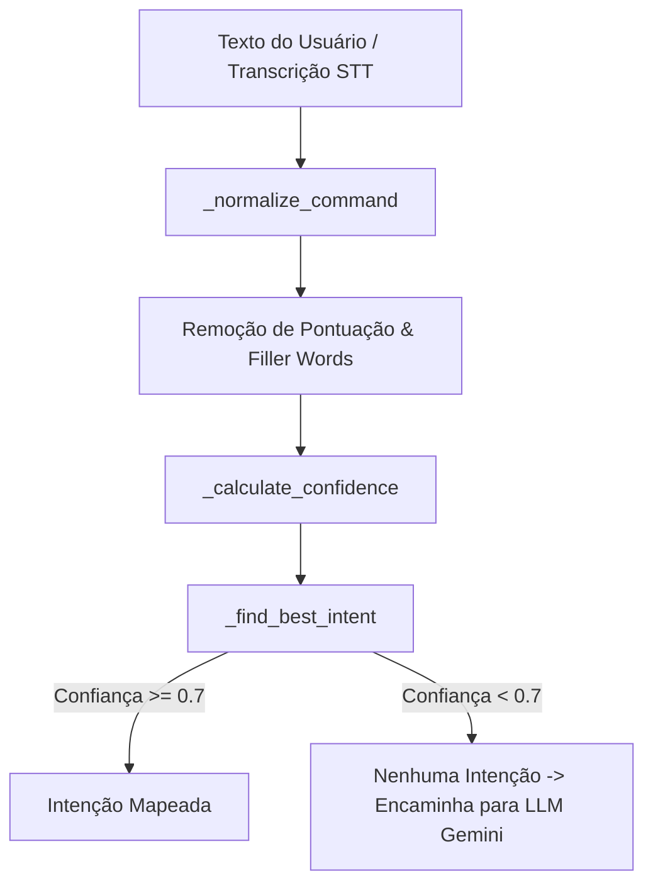

# Documentação Técnica: Interpretador de Comandos (`.kamila/core/interpreter.py`)

Esta documentação descreve em detalhes o funcionamento do módulo **`interpreter.py`**, representado pela classe `CommandInterpreter`. Este componente é a camada de **Entendimento de Linguagem Natural (NLU)** da assistente **Kamila**, responsável por analisar o texto do usuário, calcular a pontuação de confiança e identificar a intenção (*intent*) correspondente.

---

## 1. Visão Geral da Arquitetura

O `CommandInterpreter` analisa frases recebidas por texto (CLI) ou transcritas por áudio (STT), aplicando normalização linguística e um motor de correspondência Regex com pontuação probabilística.



---

## 2. Estrutura e Atributos da Classe `CommandInterpreter`

### 2.1 Construtor (`__init__`)
- **`confidence_threshold`**: Limiar mínimo de confiança para aceitar uma intenção (padrão: `0.7`).
- **`max_alternatives`**: Número máximo de sugestões contextuais (padrão: `3`).
- **`current_context`**: Contexto atual do sistema (padrão: `"general"`).
- **`intents`**: Dicionário estruturado carregado pelo método `_load_intents()`.

---

## 3. Principais Categorias de Intenções Mapeadas (`_load_intents`)

| Categoria | Intenções Mapeadas | Descrição dos Padrões Regex |
| :--- | :--- | :--- |
| **Social / Sistema** | `greeting`, `goodbye`, `time`, `date`, `weather`, `help`, `status` | Saudações, despedidas, consulta de hora/data/clima e menu de ajuda. |
| **Saúde e Emergência** | `health_protocol`, `dim_lights`, `lower_volume`, `emergency_contact`, `record_crisis`, `daily_checkin`, `medication_reminder` | Ativação do protocolo de apoio em crises de saúde, redução de estímulos visuais/sonoros, notificação de socorro e avisos de medicação. |
| **Visão & Vigilância** | `start_monitoring`, `stop_monitoring`, `monitoring_status`, `camera_monitor` | Controle de monitoramento continuo de quedas/convulsões via webcam e captura de fotos. |
| **Privacidade** | `clear_history` | Solicitação para apagar o histórico recente de conversas. |
| **Automação de PC** | `execute_on_pc` | Captura verbos de ação gráfica no computador (*"abrir"*, *"clicar"*, *"pesquisar"*). |
| **Dispositivos & Mídia** | `music`, `lights`, `volume` | Comandos para iluminação inteligente, controle de som e música. |

---

## 4. Algoritmos e Métodos Internos

### 4.1 Normalização de Texto (`_normalize_command`)
```python
def _normalize_command(self, command: str) -> str:
```
1. Converte a string para minúsculas e remove espaços nas pontas (`strip()`).
2. Remove caracteres de pontuação não alfanuméricos (`re.sub(r'[^\w\s]', ' ', normalized)`).
3. Remove palavras de preenchimento desnecessárias (*filler words*) como:
   - *"por favor"*, *"por gentileza"*, *"você pode"*, *"me diz"*, *"me fala"*.
4. Reduz múltiplos espaços consecutivos para um único espaço.

---

### 4.2 Cálculo de Confiança (`_calculate_confidence`)
```python
def _calculate_confidence(self, command: str, patterns: List[str]) -> float:
```
- Para cada padrão Regex associado a uma intenção:
  1. Verifica se há correspondência parcial ou exata no comando.
  2. Extrai o conjunto de palavras do padrão ($W_p$) e o conjunto de palavras do comando ($W_c$).
  3. Calcula o grau de cobertura:
     $$\text{Confiança} = \frac{|W_p \cap W_c|}{|W_p|}$$
  4. Mantém o maior valor de confiança encontrado entre todos os padrões daquela intenção.

---

### 4.3 Geração e Personalização de Respostas (`get_response_for_intent`)
```python
def get_response_for_intent(self, intent: str, context: Dict[str, Any] = None) -> str:
```
- Seleciona uma resposta aleatória da lista de respostas associada à intenção.
- Substitui *placeholders* dinâmicos:
  - `{time}`: Hora atual (`HH:MM`).
  - `{date}`: Data atual (`DD/MM/YYYY`).
  - `{day}`: Dia da semana em texto.
  - `{user_name}`: Nome cadastrado do usuário.
  - `{assistant_name}`: `"Kamila"`.

---

## 5. Resumo das Funções de Gerenciamento

- **`interpret_command(command)`**: Método principal que retorna o nome da intenção identificada ou `None` caso a confiança seja inferior a 0.7.
- **`add_custom_intent(name, patterns, responses, context)`**: Permite incluir novas intenções dinamicamente.
- **`get_context_suggestions(partial_command)`**: Extrai sugestões de autocompletar para trechos parciais digitados pelo usuário.
- **`set_confidence_threshold(threshold)`**: Ajusta o valor do limiar de aceitação (0.0 a 1.0).
