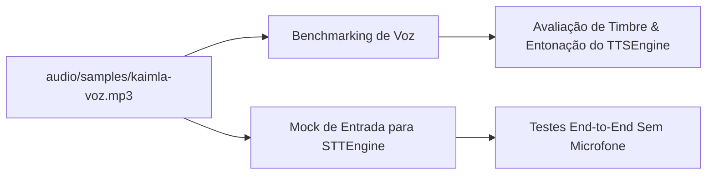

# Documentação Técnica: Amostra de Voz de Referência (`audio/samples/kaimla-voz.mp3`)

Esta documentação descreve a função, as especificações técnicas e a aplicação do arquivo **`kaimla-voz.mp3`**, localizado no caminho `audio/samples/kaimla-voz.mp3`. Este ativo binário é a **amostra oficial de referência da voz** da assistente **Kamila**.

---

## 1. Visão Geral e Propósito

O arquivo `kaimla-voz.mp3` armazena a gravação sonora padrão que define a identidade vocal da assistente. Ele serve como gabarito para calibração do motor de síntese de voz (TTS) e como fonte de áudio sintético para testes automatizados do reconhecedor de fala (STT).

---

## 2. Especificações do Ativo de Mídia

| Propriedade | Detalhe |
| :--- | :--- |
| **Caminho Relativo** | `audio/samples/kaimla-voz.mp3` |
| **Formato de Contêiner** | `MPEG Audio Layer III (.mp3)` |
| **Tamanho do Arquivo** | `499.756 bytes` (~488 KB) |
| **Identidade Vocal** | Voz padrão Kamila (Feminino / Português do Brasil - pt-BR) |

---

## 3. Aplicações no Projeto

1. **Gabarito de Qualidade Vocal**: Utilizado para comparar a saída do sintetizador nativo `TTSEngine` com o tom de voz ideal planejado para a assistente.
2. **Teste Automatizado em CI/CD**: Serve como stream de áudio de entrada para injetar frases no reconhecedor `STTEngine` durante pipelines de teste onde não há hardware de microfone disponível.
3. **Preservação de Ativos**: Garantia de persistência do perfil de voz da Kamila através das versões do software.
