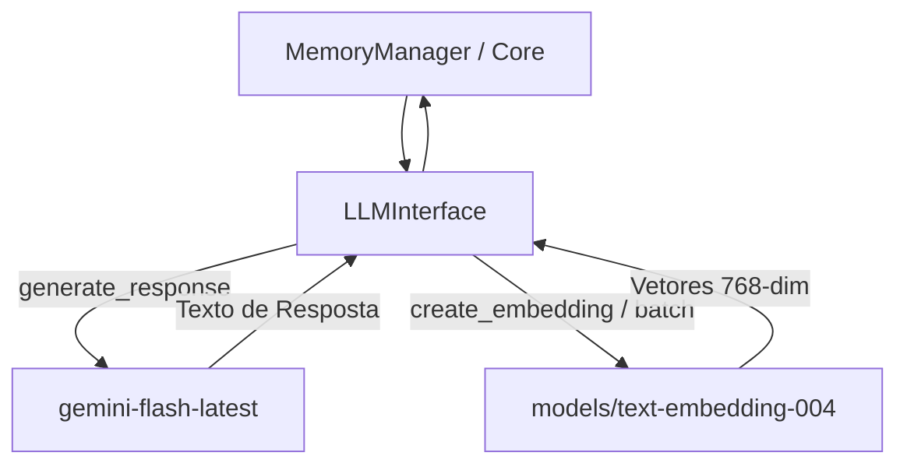

# Documentação Técnica: Módulo de Modelos de IA (`kamila_ia_models/`)

Esta documentação descreve o funcionamento e a arquitetura do pacote **`kamila_ia_models`**, localizado em `kamila_ia_models/`, e sua classe principal **`LLMInterface`** (`kamila_ia_models/llm_interface.py`). Este componente atua como a **camada unificada de inferência e vetorização** da assistente **Kamila**, conectando o sistema aos modelos Google Gemini.

---

## 1. Visão Geral da Arquitetura

O `kamila_ia_models` é responsável por encapsular todas as chamadas à API `google.generativeai`, fornecendo métodos limpos para a geração de respostas textuais e a criação de vetores de embedding para o banco vetorial **ChromaDB**.



---

## 2. Modelos Padrão Utilizados

| Função | Nome do Modelo no Google AI | Descrição |
| :--- | :--- | :--- |
| **Geração Generativa** | `gemini-flash-latest` | Modelo multimodal ultra-rápido de baixa latência para respostas de conversa. |
| **Vetorização (Embeddings)** | `models/text-embedding-004` | Modelo otimizado para transformar textos e consultas RAG em vetores de 768 dimensões. |

---

## 3. Detalhamento dos Métodos da Classe `LLMInterface`

### 3.1 `__init__(text_model_name: str, embedding_model_name: str)`
- Valida a presença da chave `GOOGLE_AI_API_KEY` no ambiente (`.env`).
- Inicializa a biblioteca `google.generativeai` via `genai.configure(api_key=...)`.
- Instancia o modelo generativo principal `genai.GenerativeModel(text_model_name)`.

---

### 3.2 `generate_response(prompt: str) -> str`
```python
response = self.text_model.generate_content(prompt)
return response.text
```
- Submete o prompt formatado com contexto para o Gemini.
- Trata exceções de limite de quota ou rede, retornando a mensagem de contingência: *"Desculpe, tive um problema para pensar na resposta."*.

---

### 3.3 `create_embedding(text: str) -> List[float]`
```python
result = genai.embed_content(model=self.embedding_model_name, content=text)
return result['embedding']
```
- Converte um único segmento de texto em um vetor numérico de alta precisão.
- Retorna uma lista de números flutuantes (`List[float]`).

---

### 3.4 `create_embeddings_batch(texts: List[str]) -> List[List[float]]`
```python
result = genai.embed_content(model=self.embedding_model_name, content=texts)
return result['embedding']
```
- Processa uma lista de documentos em lote em uma única chamada HTTP.
- Essencial para a carga e indexação inicial de memórias históricas no banco RAG.
