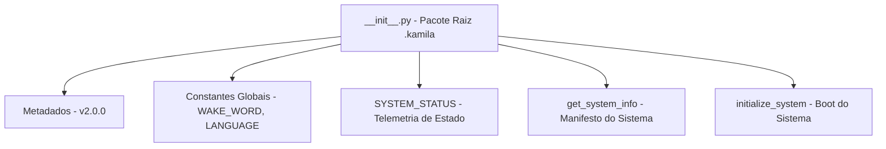

# Documentação Técnica: Inicializador do Pacote Raiz (`.kamila/__init__.py`)

Esta documentação descreve o funcionamento do arquivo **`__init__.py`** localizado no diretório raiz do ecossistema `.kamila/`. Este arquivo atua como o manifesto e o ponto de controle de estado global do projeto **Kamila Assistant**.

---

## 1. Visão Geral da Arquitetura

O `.kamila/__init__.py` transforma a pasta `.kamila` em um pacote Python de alto nível (versão `2.0.0`), expondo constantes de configuração globais, dicionário de telemetria do sistema (`SYSTEM_STATUS`) e rotinas para verificação do estado operacional da assistente.



---

## 2. Metadados e Constantes Globais

| Constante | Valor | Descrição |
| :--- | :--- | :--- |
| **`__version__`** | `"2.0.0"` | Versão principal da assistente Kamila. |
| **`__author__`** | `"Kauê Martins"` | Desenvolvedor e autor do projeto. |
| **`__description__`** | `"Assistente Virtual com IA e Voz"` | Descrição resumida da aplicação. |
| **`DEFAULT_WAKE_WORD`** | `"kamila"` | Palavra de ativação padrão para acionamento por voz. |
| **`DEFAULT_LANGUAGE`** | `"pt-BR"` | Idioma de processamento STT/TTS do sistema. |
| **`DEFAULT_TIMEOUT`** | `30` | Tempo máximo de inatividade padrão (em segundos). |

---

## 3. Estrutura de Estado do Sistema (`SYSTEM_STATUS`)

O dicionário `SYSTEM_STATUS` rastreia a operacionalidade em tempo real da assistente:

```python
SYSTEM_STATUS = {
    "initialized": False,          # Se a assistente concluiu a carga inicial
    "wake_word_detected": False,   # Estado de escuta da palavra-chave
    "processing_command": False,   # Se um comando de voz/ação está em execução
    "last_interaction": None       # Timestamp da última mensagem
}
```

---

## 4. Detalhamento das Funções

### 4.1 `get_system_info() -> Dict[str, str]`
- **Descrição**: Retorna o dicionário com as informações gerais e configurações ativas do sistema:
  ```json
  {
    "name": "Kamila Assistant",
    "version": "2.0.0",
    "author": "Kauê Martins",
    "description": "Assistente Virtual com IA e Voz",
    "wake_word": "kamila",
    "language": "pt-BR"
  }
  ```

---

### 4.2 `initialize_system() -> bool`
- **Descrição**: Define a flag global `SYSTEM_STATUS["initialized"] = True` e reseta o marcador `last_interaction`, indicando que todos os motores foram carregados com sucesso.
