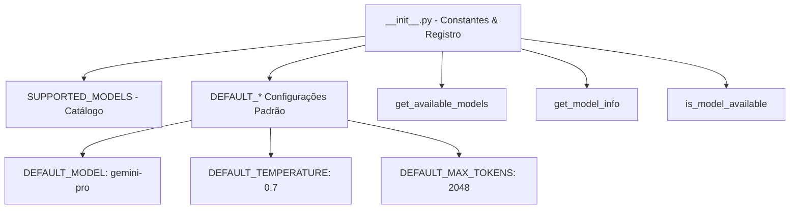

# Documentação Técnica: Inicializador do Pacote LLM (`.kamila/llm/__init__.py`)

Esta documentação descreve em detalhes o funcionamento do arquivo de inicialização **`__init__.py`** do pacote de modelos de linguagem, localizado em `.kamila/llm/__init__.py`. Este módulo define as configurações globais, hiperparâmetros padrão e utilitários de checagem de modelos da assistente **Kamila**.

---

## 1. Visão Geral da Arquitetura

O `__init__.py` transforma o diretório `.kamila/llm` em um pacote Python estruturado e fornece um catálogo centralizado dos modelos suportados e suas configurações de inferência.



---

## 2. Metadados e Hiperparâmetros Padrão

| Constante | Valor | Descrição |
| :--- | :--- | :--- |
| **`__version__`** | `"1.0.0"` | Versão do pacote de LLM. |
| **`__author__`** | `"Kauê Martins"` | Autor do módulo. |
| **`DEFAULT_MODEL`** | `"gemini-pro"` | Modelo primário utilizado para respostas gerais. |
| **`DEFAULT_TEMPERATURE`** | `0.7` | Nível de criatividade na geração de texto. |
| **`DEFAULT_MAX_TOKENS`** | `2048` | Tamanho máximo da resposta em tokens. |
| **`DEFAULT_TIMEOUT`** | `30` | Tempo máximo de espera da API em segundos. |

---

## 3. Catálogo de Modelos Suportados (`SUPPORTED_MODELS`)

```python
SUPPORTED_MODELS = {
    "gemini-pro": "Google Gemini Pro",
    "gemini-pro-vision": "Google Gemini Pro Vision",
    "ai-studio-palm": "Google AI Studio PaLM",
    "ai-studio-gemini": "Google AI Studio Gemini"
}
```

---

## 4. Funções Utilitárias

### 4.1 `get_available_models() -> List[str]`
- **Descrição**: Retorna a lista contendo as chaves dos modelos suportados (`['gemini-pro', 'gemini-pro-vision', ...]`).

### 4.2 `get_model_info(model_name: str) -> str`
- **Descrição**: Retorna a descrição legível do modelo solicitado. Se o nome não existir no catálogo, retorna `"Modelo não encontrado"`.

### 4.3 `is_model_available(model_name: str) -> bool`
- **Descrição**: Retorna `True` se o modelo informado for suportado pelo sistema, ou `False` caso contrário.
