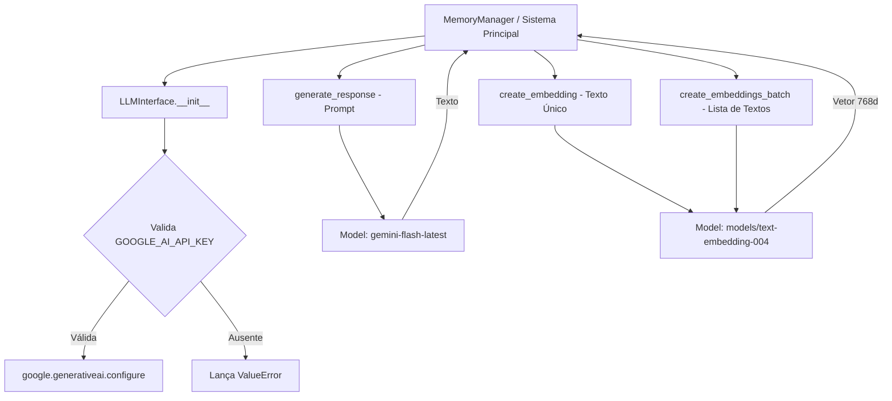

# Documentação Técnica: Interface Unificada de LLM (`kamila_ia_models/llm_interface.py`)

Esta documentação detalha a classe **`LLMInterface`**, localizada no arquivo `kamila_ia_models/llm_interface.py`. Este módulo fornece a **camada de abstração de IA generativa e vetorização de texto**, permitindo que os subsistemas da assistente **Kamila** (como o `MemoryManager`) interajam com a API do Google Gemini sem acoplamento direto de código.

---

## 1. Visão Geral da Classe `LLMInterface`

A `LLMInterface` encapsula as chamadas de texto generativo e criação de embeddings vetoriais. Ela é responsável por tratar exceções de rede e quota, garantindo que o sistema continue estável mesmo durante oscilações de conexão.



---

## 2. Assinatura e Métodos da Classe

### 2.1 Construtor (`__init__`)
```python
def __init__(self, text_model_name: str = 'gemini-flash-latest', embedding_model_name: str = 'models/text-embedding-004')
```
- **Argumentos**:
  - `text_model_name` (padrão: `'gemini-flash-latest'`): Especifica o modelo para respostas em linguagem natural.
  - `embedding_model_name` (padrão: `'models/text-embedding-004'`): Especifica o modelo para geração de vetores de embedding.
- **Comportamento**: Carrega a variável `GOOGLE_AI_API_KEY` do ambiente. Se ausente, lança `ValueError`.

---

### 2.2 Geração de Conteúdo (`generate_response`)
```python
def generate_response(self, prompt: str) -> str
```
- **Entrada**: Prompt contendo o contexto RAG e a pergunta do usuário.
- **Saída**: String com a resposta gerada pelo modelo.
- **Tratamento de Exceções**: Se a chamada falhar, captura o erro, imprime no console e retorna a mensagem de contingência: *"Desculpe, tive um problema para pensar na resposta."*.

---

### 2.3 Geração de Embedding Unitário (`create_embedding`)
```python
def create_embedding(self, text: str) -> List[float]
```
- **Entrada**: String individual a ser vetorizada.
- **Saída**: Lista de números flutuantes de 768 posições (`List[float]`).
- **Tratamento de Exceções**: Retorna lista vazia `[]` em caso de erro.

---

### 2.4 Geração de Embeddings em Lote (`create_embeddings_batch`)
```python
def create_embeddings_batch(self, texts: List[str]) -> List[List[float]]
```
- **Entrada**: Coleção de frases/documentos `List[str]`.
- **Saída**: Lista de vetores de embedding `List[List[float]]`.
- **Otimização**: Processa a coleção em uma única chamada HTTP REST na API do Google AI, reduzindo drasticamente a latência de indexação do banco vetorial.
