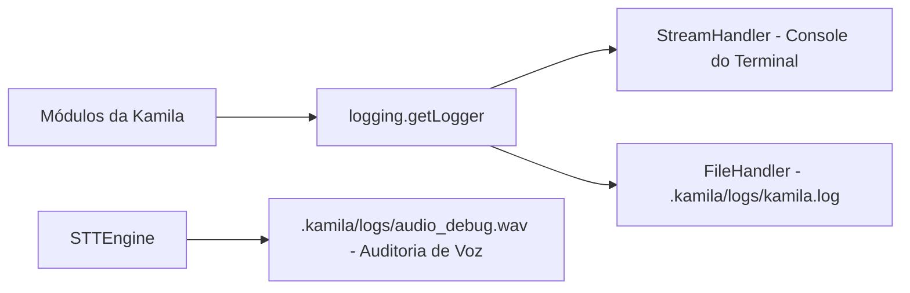

# Documentação Técnica: Sistema de Logs e Diagnóstico (`.kamila/logs/`)

Esta documentação descreve a estrutura, a função e a política de manutenção do diretório **`logs`**, localizado no caminho `.kamila/logs/`. Este diretório é utilizado por todos os módulos da assistente **Kamila** para gravação contínua de telemetria, diagnóstico de falhas, auditoria de comandos e depuração de áudio.

---

## 1. Visão Geral da Arquitetura

O sistema de logs registra a atividade dos 7 motores centrais (STT, TTS, NLU, Memória, Ações, Gemini LLM e AI Studio) em dois manipuladores simultâneos (*handlers*): o console do terminal (`StreamHandler`) e o arquivo físico de log (`FileHandler`).



---

## 2. Conteúdo e Arquivos do Diretório

| Arquivo | Tipo | Descrição |
| :--- | :--- | :--- |
| **`kamila.log`** | Texto Plano (UTF-8) | Registra mensagens do sistema com carimbo de data/hora, nível de severidade e o nome do módulo emissor. |
| **`audio_debug.wav`** | Áudio PCM WAV (16kHz) | Gravação temporária do último trecho de voz capturado pelo microfone, utilizada para diagnóstico de ruído e calibração de STT. |

---

## 3. Formato do Registrador (`logging.basicConfig`)

Os logs seguem o padrão de formatação estruturado:

```text
%(asctime)s - %(name)s - %(levelname)s - %(message)s
```

### Exemplo de Entrada no `kamila.log`:
```text
2026-07-23 19:40:12,123 - core.stt_engine - INFO - 🎤 Inicializando STT Engine...
2026-07-23 19:40:13,456 - core.stt_engine - INFO - Porcupine configurado com sucesso para wake word 'kamila'
2026-07-23 19:40:15,789 - core.interpreter - INFO - Intenção identificada: health_protocol (Confiança: 0.92)
2026-07-23 19:40:16,012 - core.actions - WARNING - Ativando protocolo de apoio em emergência médica!
```

---

## 4. Níveis de Severidade

- **`DEBUG`**: Detalhes de baixo nível (ex: recepção de quadros PCM, checagem de timeout).
- **`INFO`**: Eventos normais do ciclo de vida (ex: inicialização de motores, comandos reconhecidos).
- **`WARNING`**: Avisos de contingência (ex: API Key ausente, chaveamento para modo simulado).
- **`ERROR`**: Exceções tratadas e falhas pontuais de serviços (ex: erro de rede na API de fala).
- **`CRITICAL`**: Falhas fatais que exigem o encerramento do processo.

---

## 5. Boas Práticas e Segurança

> [!NOTE]
> **Proteção no Git**: O arquivo `*.log` e gravações temporárias de áudio estão incluídos no `.gitignore`. NUNCA faça commit de arquivos de log no repositório público para evitar vazamento de credenciais de ambiente ou histórico de áudio do microfone.
