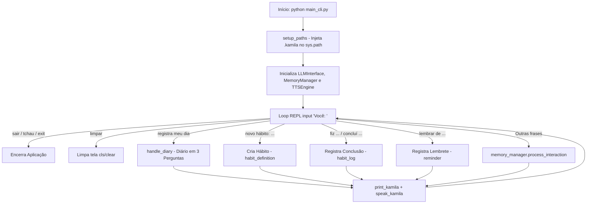

# Documentação Técnica: Interface de Linha de Comando (CLI) (`main_cli.py`)

Esta documentação descreve a arquitetura, o funcionamento e os fluxos interativos do arquivo **`main_cli.py`**, localizado na raiz em `main_cli.py`. Este módulo fornece a **interface de texto REPL com resposta por voz opcional**, permitindo ao usuário interagir com a assistente Kamila no terminal, registrar diários de produtividade, gerenciar hábitos e cadastrar lembretes.

---

## 1. Visão Geral da Arquitetura

O `main_cli.py` conecta a entrada do usuário por teclado à camada de memória vetorial (`MemoryManager`) e à síntese de fala (`TTSEngine`).



---

## 2. Recursos e Fluxos Especiais

### 2.1 Fluxo de Diário Guiado (`handle_diary`)
Ao receber o comando *"registra meu dia"* ou *"registrar meu dia"*, a Kamila conduz uma entrevista em 3 perguntas:
1. *"O que você fez de mais importante hoje?"*
2. *"O que você aprendeu ou poderia ter feito melhor?"*
3. *"Como você se sentiu na maior parte do dia?"*

As respostas são consolidadas e salvas na memória vetorial com os metadados `{"type": "diary_entry"}`.

---

### 2.2 Gestão de Hábitos e Disciplina
- **Criação de Hábito**: Sintaxe `novo hábito: <nome>`. Salva com metadados `{"type": "habit_definition"}`.
- **Check-in de Hábito**: Sintaxe `fiz <hábito>` ou `concluí <hábito>`. Salva com metadados `{"type": "habit_log", "status": "completed"}`.

---

### 2.3 Registro de Lembretes
- **Sintaxe**: `lembrar de <tarefa>` ou `me lembra de <tarefa>`. Salva com os metadados `{"type": "reminder", "active": True}`.

---

## 3. Como Executar

No terminal com o ambiente virtual ativo:

```bash
python main_cli.py
```
