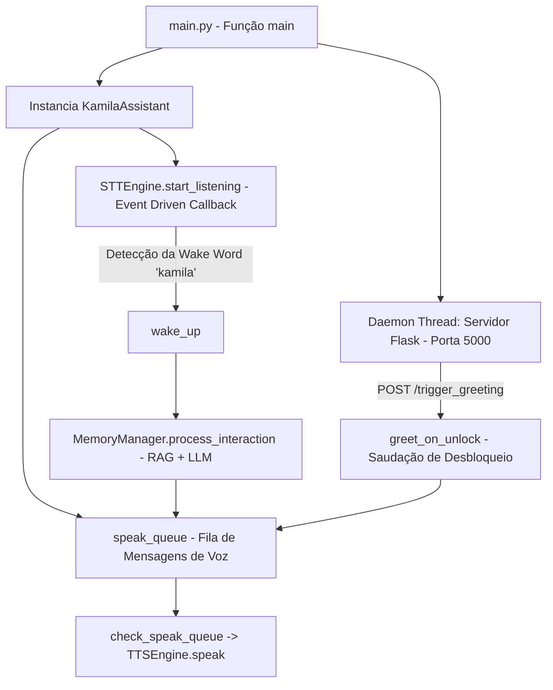

# Documentação Técnica: Ponto de Entrada Principal da Kamila (`.kamila/main.py`)

Esta documentação descreve o funcionamento do arquivo **`main.py`**, localizado no diretório `.kamila/main.py`. Este módulo é o **ponto de entrada da versão de produção** da assistente **Kamila**, unindo voz assíncrona orientada a eventos, gerenciamento de memória RAG com LLM, fila de áudio não bloqueante e um servidor web Flask para automações de sistema.

---

## 1. Visão Geral da Arquitetura

O `main.py` integra a assistente por voz com um microserviço HTTP REST interno. Isso permite que a Kamila responda tanto a acionamentos vocais diretos quanto a gatilhos disparados pelo sistema operacional (ex: desbloqueio da tela no Windows).



---

## 2. Componentes e Tecnologias Utilizadas

| Componente | Módulo / Classe | Função no Sistema |
| :--- | :--- | :--- |
| **Reconhecimento Vocal** | `STTEngine` | Escuta assíncrona orientada a eventos (*event-driven*). |
| **Síntese Vocal** | `TTSEngine` & `queue.Queue` | Consumo de mensagens de fala em ordem FIFO sem travar o loop principal. |
| **Gestão de Memória & LLM** | `MemoryManager` & `LLMInterface` | Processamento de RAG, perfil do usuário e inferência generativa. |
| **API REST Local** | `Flask` (`port=5000`) | Servidor HTTP daemon na porta 5000 para acionamentos externos do SO. |

---

## 3. Detalhamento das Funcionalidades

### 3.1 Fila de Áudio Não Bloqueante (`check_speak_queue`)
Para evitar que a síntese de voz (TTS) trave o processamento de eventos ou a escuta do microfone, todas as mensagens são enfileiradas em `self.speak_queue.put(mensagem)` e consumidas periodicamente pelo loop principal `check_speak_queue()`.

---

### 3.2 Escuta Orientada a Eventos (`wake_up`)
```python
self.stt_engine.start_listening(callback=self.wake_up)
```
- A thread do `STTEngine` roda em background.
- Ao identificar a palavra-chave *"kamila"*, a thread invoca o callback `wake_up()`.
- O método saúda o usuário, ouve o comando com timeout generoso (10 segundos) e repassa a instrução para o `MemoryManager`.

---

### 3.3 Endpoint da API REST (`/trigger_greeting`)
```python
@app.route('/trigger_greeting', methods=['POST'])
def trigger_greeting():
```
- Rota HTTP POST exposta na porta `5000`.
- Permite que scripts de automação (ex: PowerShell ou Agendador de Tarefas do Windows ao desbloquear a sessão) enviem um evento para a Kamila.
- Dispara uma thread rápida executando `greet_on_unlock()`, que enfileira a fala *"Bem-vindo de volta, [Nome]!"*.

---

### 3.4 Processamento de Comandos (`process_command`)
- Envia o texto gravado do comando para `self.memory.process_interaction(command)`.
- O `MemoryManager` consulta o banco vetorial, combina o perfil do usuário com o modelo de linguagem e devolve a resposta sintetizada.
- A resposta é inserida na `speak_queue`.

---

### 3.5 Encerramento Gracioso (`shutdown`)
- Para a escuta do microfone via `stt_engine.stop_listening()`.
- Enfileira a fala final *"Até logo."*.
- Aguarda 3 segundos para que a fala seja concluída no alto-falante antes de finalizar o processo.
