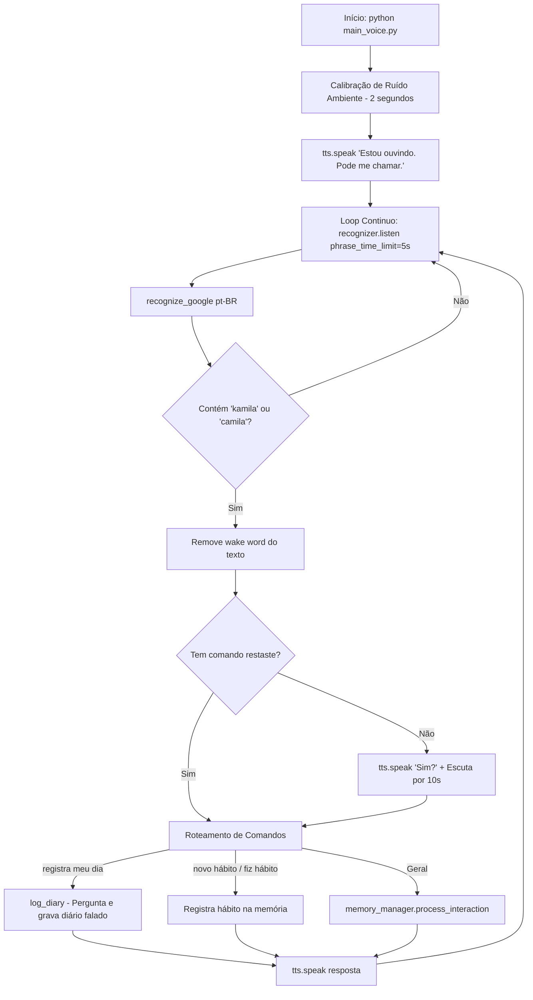

# Documentação Técnica: Interface de Voz Continuada ("Voice-First") (`main_voice.py`)

Esta documentação descreve o funcionamento e a arquitetura do script **`main_voice.py`**, localizado em `main_voice.py`. Este módulo fornece a **interface de escuta viva-voz continuada (*Voice-First Hands-Free*)**, escutando o microfone em tempo real, detectando a chamada da assistente (*"Kamila"*), processando intenções via NLU/LLM e respondendo audivelmente.

---

## 1. Visão Geral da Arquitetura

O `main_voice.py` implementa um loop de áudio sem interrupção (pipeline: **Ouvir $\rightarrow$ Processar $\rightarrow$ Falar**).



---

## 2. Componentes e Funcionalidades

### 2.1 Calibração de Ruído e Inicialização
- **`recognizer.adjust_for_ambient_noise(source, duration=2)`**: Ajusta os limiares de sensibilidade para evitar acionamentos acidentais em salas ruidosas.
- Emite o aviso audível *"Estou ouvindo. Pode me chamar."*.

---

### 2.2 Tratamento de Interação Simples ("Kamila" $\rightarrow$ "Sim?")
Se o usuário pronunciar apenas o nome *"Kamila"*, a assistente responde imediatamente *"Sim?"* por voz e entra em modo de escuta estendido (tempo limite de 10 segundos) para aguardar o comando.

---

### 2.3 Registro de Diário 100% por Voz (`log_diary`)
Sem necessitar de teclado:
1. Kamila pergunta: *"Vamos lá. O que você fez de importante hoje?"*.
2. Escuta a resposta falada via `listen_for_answer()`.
3. Armazena no banco vetorial de memória com os metadados `{"type": "diary_entry_voice"}`.
4. Responde: *"Salvei seu registro."*.

---

## 3. Como Executar

No terminal com microfone conectado e ambiente virtual ativo:

```bash
python main_voice.py
```
