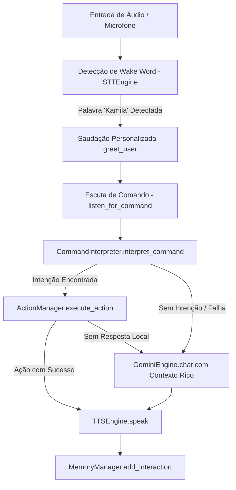

# Documentação Técnica: Ponto de Entrada Integrado (`.kamila/llm/main_with_gemini.py`)

Esta documentação descreve em detalhes o funcionamento do módulo **`main_with_gemini.py`**, representado pela classe `KamilaAssistant`. Este componente serve como o **ponto de entrada unificado e avançado** da assistente **Kamila**, conectando as interfaces de voz, o interpretador local de regras e os motores de IA generativa em nuvem (Google Gemini AI e AI Studio).

---

## 1. Visão Geral da Arquitetura

O `main_with_gemini.py` orquestra uma **arquitetura híbrida de decisão em 2 camadas**: primeiro tenta responder usando o interpretador local e ações rápidas no sistema; caso não encontre uma regra estática, recorre à inteligência generativa do Gemini.



---

## 2. Estrutura de Integração dos Componentes

O construtor `__init__` instancia e integra 7 módulos centrais do ecossistema Kamila:

| Componente | Instância | Papel no Sistema |
| :--- | :--- | :--- |
| **`stt_engine`** | `STTEngine` | Captura áudio e detecta a palavra de ativação *"Kamila"*. |
| **`tts_engine`** | `TTSEngine` | Sintetiza em voz audível as respostas geradas. |
| **`interpreter`** | `CommandInterpreter` | Avalia intenções estáticas e comandos diretos locais. |
| **`memory_manager`** | `MemoryManager` | Gerencia memória de curto prazo e banco vetorial de longo prazo. |
| **`action_manager`** | `ActionManager` | Executa comandos no sistema operacional (som, brilho, fotos, PC). |
| **`gemini_engine`** | `GeminiEngine` | Motor generativo baseado na SDK oficial do Gemini. |
| **`ai_studio`** | `AIStudioIntegration` | Integração de contingência via REST API com o Google AI Studio. |

---

## 3. Detalhamento do Fluxo de Execução (`process_command`)

```python
def process_command(self, command: str):
```

1. **Reconhecimento de Intenção Local**: O comando é passado ao `self.interpreter.interpret_command(command)`.
2. **Execução de Ação Local**: Se a intenção for conhecida, invoca `self.action_manager.execute_action(intent, command)`.
3. **Fallback Híbrido Generativo**: Se nenhuma resposta for gerada localmente, invoca o método `_build_context()` para coletar:
   - Nome do usuário (`user_name`).
   - Estado de humor (`mood`).
   - Últimas 5 interações (`conversation_history`).
   - Hora atual (`current_time`).
4. **Consulta à IA**: Envia a instrução contextualizada para `self.gemini_engine.chat(command, context)`.
5. **Síntese de Voz & Memória**: Fala a resposta via `self.tts_engine.speak()` e armazena o par de conversa no `self.memory_manager`.

---

## 4. Métodos de Suporte

- **`start()`**: Loop principal contínuo de monitoramento.
- **`greet_user()`**: Calcula o período do dia (manhã, tarde, noite) e executa a saudação vocal personalizada.
- **`shutdown()`**: Executa a rotina de desativação e desalocação limpa de recursos em todos os 7 motores (`cleanup()`).
- **`create_env_example()`**: Função utilitária que gera automaticamente o arquivo de configuração `.kamila/.env.example`.
