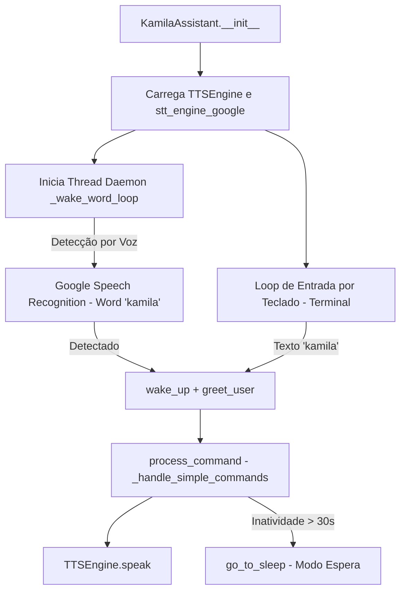

# Documentação Técnica: Ponto de Entrada via Google STT (`.kamila/main_with_google_stt.py`)

Esta documentação descreve em detalhes o funcionamento do módulo **`main_with_google_stt.py`**, representado pela classe `KamilaAssistant`. Este componente serve como um **ponto de entrada alternativo e simplificado** da assistente **Kamila**, utilizando exclusivamente o serviço **Google Speech Recognition** para a detecção de voz e palavra de ativação (*Wake Word*), sem dependências de modelos locais do Picovoice Porcupine.

---

## 1. Visão Geral da Arquitetura

O `main_with_google_stt.py` combina escuta de palavra-chave em thread separada com um canal híbrido de entrada por teclado (terminal CLI). Isso permite que o usuário interaja por voz ou por texto simultaneamente.



---

## 2. Parâmetros de Configuração e Ambiente

As configurações são carregadas do arquivo `.kamila/.env`:

| Parâmetro | Valor Padrão | Descrição |
| :--- | :--- | :--- |
| **`WAKE_WORD`** | `"kamila"` | Palavra de ativação observada tanto por áudio quanto por texto. |
| **`INACTIVITY_TIMEOUT`** | `30` | Segundos sem interações para colocar a assistente em modo de espera. |
| **`COMMAND_TIMEOUT`** | `5` | Tempo limite para escuta de rajada de comando. |

---

## 3. Detalhamento dos Métodos da Classe `KamilaAssistant`

### 3.1 `start()` e Gerenciamento de Threads
- **Detecção em Segundo Plano (`start_wake_word_detection`)**: Dispara a thread daemon `_wake_word_loop` que fica monitorando continuamente o microfone via `stt_engine.detect_wake_word("kamila", timeout=5)`.
- **Canal de Terminal Híbrido**: Enquanto a thread de voz monitora o ambiente, o loop principal no terminal permite que o usuário digite comandos diretos como fallback.

---

### 3.2 Estados da Assistente (`wake_up` & `go_to_sleep`)
- **`wake_up()`**:
  - Altera as flags `is_awake = True` e `is_listening = True`.
  - Sintetiza por voz: *"Olá! Estou acordada e pronta para ajudar!"*.
  - Atualiza o carimbo de tempo `last_interaction`.
- **`go_to_sleep()`**:
  - Altera as flags `is_awake = False` e `is_listening = False`.
  - Sintetiza por voz: *"Até logo! Me chame quando precisar."*.

---

### 3.3 Processamento de Comandos Estáticos (`_handle_simple_commands`)
```python
def _handle_simple_commands(self, command: str) -> Optional[str]:
```
Subconjunto de respostas estáticas rápidas:
- **Saudação**: *"Olá! Como posso ajudar?"*
- **Hora**: Responde a hora atual no formato `HH:MM`.
- **Data**: Retorna a data completa formatada em Português (`Dia da semana, DD de Mês de AAAA`).
- **Status**: *"Estou funcionando perfeitamente! Pronta para ajudar!"*.
- **Despedida**: *"Tchau! Foi bom conversar com você!"* e aciona `go_to_sleep()`.

---

### 3.4 Desativação de Recursos (`shutdown`)
- Para a thread de monitoramento da palavra-chave (`stop_wake_word_detection()`).
- Executa a síntese de despedida por voz.
- Invoca o `cleanup()` dos motores de síntese (`TTSEngine`) e reconhecimento de voz (`STTEngine`).
