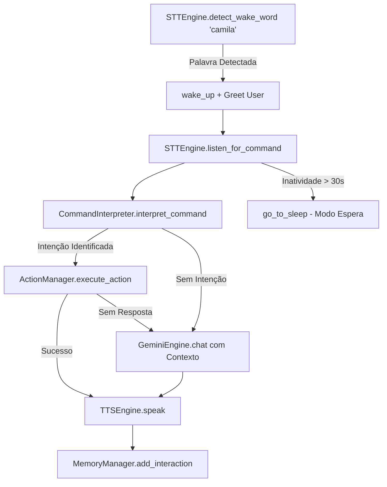

# Documentação Técnica: Ponto de Entrada com Suporte Híbrido a LLM (`.kamila/main_with_llm.py`)

Esta documentação descreve o funcionamento do módulo **`main_with_llm.py`**, representado pela classe `CamilaAssistant`. Este componente é um **ponto de entrada completo para monitoramento clínico e voz**, orquestrando todos os motores do diretório `core` com os clientes de IA generativa do pacote `llm`.

---

## 1. Visão Geral da Arquitetura

O `main_with_llm.py` implementa a assistente com foco em acolhimento emocional e cuidados de saúde. Ele monitora a inatividade do usuário e alterna entre o estado ativo e o estado de espera (*sleep mode*).

---

## 2. Diferenciais Deste Módulo Entrypoint

1. **Injeção de TTS no `ActionManager`**: Passa a instância do motor de fala diretamente no construtor (`self.action_manager = ActionManager(self.tts_engine)`), permitindo que comandos do SO emitam feedbacks em áudio em tempo real.
2. **Mensagens Enfáticas de Apoio Emocional**:
   - **Ao Acordar**: *"Ei! Tô aqui pra você. Respira comigo, tá tudo bem."*
   - **Ao Dormir**: *"Tô aqui sempre que precisar, tá? Cuida bem de você."*
   - **No Encerramento**: *"Tô orgulhosa de você. Cuida bem de si mesmo, tá?"*
3. **Gerenciamento de Inatividade**: Controla o tempo transcorrido desde a última mensagem (`last_interaction`). Se o silêncio ultrapassar `inactivity_timeout` (30 segundos), desativa a escuta para economizar processamento.

---

## 3. Detalhamento dos Métodos da Classe `CamilaAssistant`

### 3.1 `start()`
- Mantém o loop `while True` verificando:
  - **Checagem de Inatividade**: `if self.is_awake and (time.time() - self.last_interaction) > self.inactivity_timeout: self.go_to_sleep()`.
  - **Aguardando Wake Word**: `self.stt_engine.detect_wake_word("camila")`.
  - **Processamento de Comandos**: `self.stt_engine.listen_for_command()`.

---

### 3.2 `process_command(command)`
- Envia o texto para `CommandInterpreter`.
- Executa a ação pelo `ActionManager`.
- Se a intenção não for mapeada localmente, monta o mapa de contexto (`_build_context()`) contendo `user_name`, `mood`, `conversation_history` e `current_time`, submetendo a requisição ao `GeminiEngine`.
- Atualiza a memória de curto e longo prazo no `MemoryManager`.

---

### 3.3 `shutdown()`
- Desativa e desaloca a memória de todos os motores integrados (`stt_engine`, `tts_engine`, `gemini_engine`, `ai_studio`).
