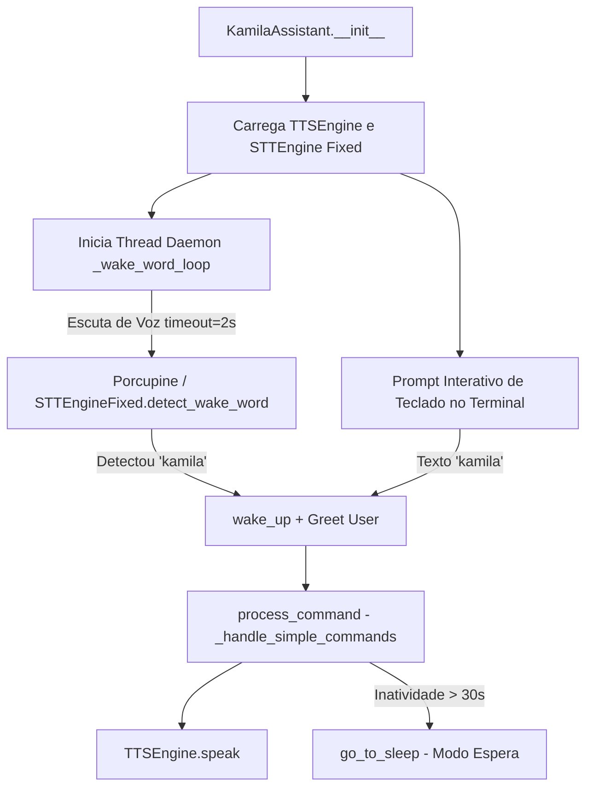

# Documentação Técnica: Ponto de Entrada com Wake Word Otimizada (`.kamila/main_with_wake_word.py`)

Esta documentação descreve em detalhes o funcionamento do módulo **`main_with_wake_word.py`**, representado pela classe `KamilaAssistant`. Este componente é um **ponto de entrada focado em acionamento por voz em tempo real**, integrando o motor de fala ajustado `stt_engine_fixed` com a síntese nativa do `tts_engine`.

---

## 1. Visão Geral da Arquitetura

O `main_with_wake_word.py` utiliza a biblioteca Picovoice Porcupine e o motor `stt_engine_fixed` para manter um loop de escuta contínua de baixa latência em segundo plano, oferecendo também um canal de digitação no terminal como fallback.



---

## 2. Parâmetros de Ajuste de Desempenho

| Configuração | Valor | Descrição |
| :--- | :--- | :--- |
| **`WAKE_WORD`** | `"kamila"` | Palavra de ativação cadastrada no modelo Porcupine `.ppn`. |
| **`timeout (detect_wake_word)`** | `2s` | Tempo limite reduzido de escuta por bloco, garantindo alta responsividade. |
| **`INACTIVITY_TIMEOUT`** | `30s` | Tempo sem mensagens para desativar o modo escuta. |

---

## 3. Detalhamento dos Métodos da Classe `KamilaAssistant`

### 3.1 `start()` e Gerenciamento de Threads
- **Início da Thread (`start_wake_word_detection`)**: Dispara a thread daemon `_wake_word_loop` responsável pela monitoria contínua de áudio.
- **Terminal Interativo**: Permite digitação direta no console enquanto a assistente aguarda o acionamento por voz.

---

### 3.2 Loop de Palavra de Ativação (`_wake_word_loop`)
```python
def _wake_word_loop(self):
```
- Roda continuamente enquanto `self.stop_listening` for `False`.
- Invoca `self.stt_engine.detect_wake_word(self.wake_word, timeout=2)`.
- Ao identificar a palavra *"kamila"*, exibe no log `🗣️ Wake word detectada!` e aciona `wake_up()` e `greet_user()`.

---

### 3.3 Processamento de Comandos Simples (`_handle_simple_commands`)
Processa requisições de utilidade rápida:
- **Hora**: `datetime.now().strftime('%H:%M')`.
- **Data**: `datetime.now().strftime('%A, %d de %B de %Y')`.
- **Ajuda**: Lista os comandos textuais disponíveis no terminal.
- **Status**: Retorna a saúde da assistente e sintetiza a fala.

---

### 3.4 Desalocação Limpa de Recursos (`shutdown`)
- Para a thread de escuta (`stop_wake_word_detection()`).
- Executa a síntese de despedida por voz.
- Invoca `stt_engine.cleanup()` e `tts_engine.cleanup()`.
