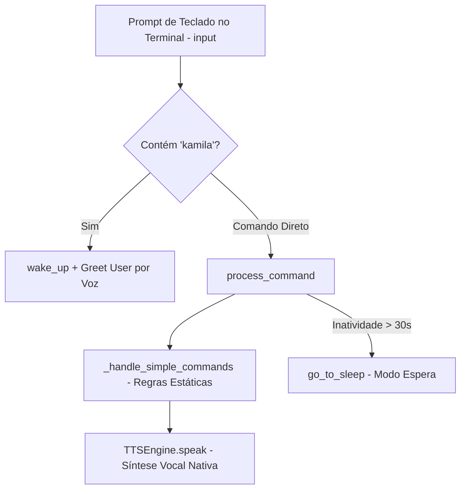

# Documentação Técnica: Ponto de Entrada Simplificado de Diagnóstico (`.kamila/main_working.py`)

Esta documentação descreve em detalhes o funcionamento do módulo **`main_working.py`**, representado pela classe `KamilaAssistant`. Este componente serve como um **ponto de entrada simplificado para testes de bancada (*smoke tests*)**, projetado para validar a máquina de estados, o timeout de inatividade e a síntese de voz (TTS) sem depender de captura de áudio por microfone ou serviços de nuvem.

---

## 1. Visão Geral da Arquitetura

O `main_working.py` descarta dependências pesadas de Speech-to-Text (como PyAudio ou Porcupine), utilizando a entrada de texto do terminal (`input()`) para comandos e o motor `TTSEngine` para respostas em áudio.

---

## 2. Casos de Uso e Vantagens

- **Diagnóstico Rápido de Áudio**: Ideal para testar se os alto-falantes e vozes nativas do sistema operacional (SAPI5 no Windows) estão funcionando corretamente.
- **Execução Sem Microfone**: Permite operar a assistente em ambientes de servidor, máquinas virtuais ou computadores sem dispositivo físico de captura de som.
- **Validação da Máquina de Estados**: Permite auditar a alternância entre estado ativo (`is_awake = True`) e modo de espera (`go_to_sleep`).

---

## 3. Detalhamento dos Métodos da Classe `KamilaAssistant`

### 3.1 `__init__()`
- Instancia apenas o motor de síntese vocal `TTSEngine()`.
- Inicializa a máquina de estados (`is_awake = False`, `inactivity_timeout = 30s`).

---

### 3.2 `start()`
- Exibe o menu principal de boas-vindas no console.
- Roda o loop `while True` monitorando:
  - **Inatividade**: `if self.is_awake and (time.time() - self.last_interaction) > self.inactivity_timeout: self.go_to_sleep()`.
  - **Ativação por Teclado**: Exige a palavra `"kamila"` na string digitada para acionar a assistente.

---

### 3.3 Comandos Internos (`_handle_simple_commands`)
- **`hora`**: `datetime.now().strftime('%H:%M')`.
- **`data`**: `datetime.now().strftime('%A, %d de %B de %Y')`.
- **`ajuda`**: Exibe no console a lista de comandos suportados.
- **`status`**: Sintetiza *"Estou funcionando perfeitamente! Pronta para ajudar!"*.
- **`tchau` / `sair`**: Coloca a assistente em espera e encerra a sessão.

---

### 3.4 Desalocação (`shutdown`)
- Executa a síntese de áudio da mensagem de despedida e invoca `self.tts_engine.cleanup()`.
