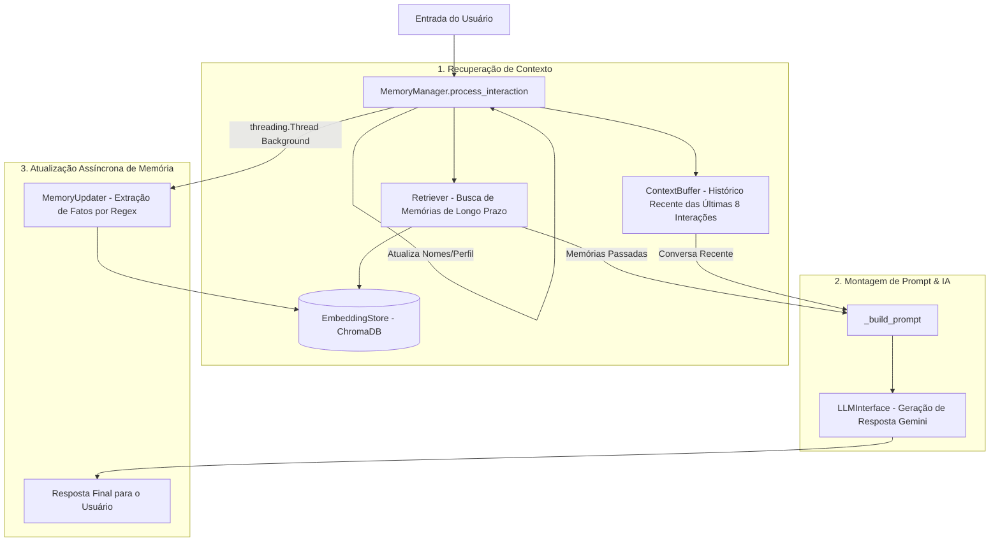

# Documentação Técnica: Gerenciador Central de Memória (`.kamila/core/memory_manager.py`)

Esta documentação descreve em detalhes o funcionamento do módulo **`memory_manager.py`**, representado pela classe `MemoryManager`. Este componente é o **orquestrador central de memória e contexto** da assistente **Kamila**, conectando a memória de curto prazo (*sliding window*), a memória de longo prazo (vetorial via ChromaDB), o mecanismo de recuperação semântica e o aprendizado assíncrono de fatos.

---

## 1. Visão Geral da Arquitetura

O `MemoryManager` funciona como uma ponte entre o usuário e o modelo de linguagem (Gemini LLM), injetando inteligência contextualizada e mantendo estado entre conversas.



---

## 2. Componentes Integrados no Construtor (`__init__`)

```python
def __init__(self, llm_interface: LLMInterface, user_name: str = "usuário"):
```

| Componente | Instância | Função no Sistema |
| :--- | :--- | :--- |
| **`self.llm`** | `LLMInterface` | Interface com a API de LLM para embeddings e respostas. |
| **`self.buffer`** | `ContextBuffer(size=8)` | Mantém as 8 mensagens mais recentes em fila circular de curto prazo. |
| **`self.store`** | `EmbeddingStore(llm_interface)` | Gerencia o banco vetorial ChromaDB persistente em disco. |
| **`self.retriever`** | `Retriever(self.store)` | Executa a busca vetorial por relevância semântica. |
| **`self.updater`** | `MemoryUpdater(self.store)` | Analisa o texto do usuário para extrair fatos pessoais automaticamente. |

---

## 3. Detalhamento dos Métodos Principais

### 3.1 `process_interaction(user_input: str) -> str`

Este é o método primário invocado pelas interfaces `main_cli.py` e `main_voice.py` a cada mensagem enviada pelo usuário.

#### Sequência de Execução:
1. **Recuperação Semântica**: Executa `self.retriever.retrieve_relevant_memories(user_input)` para resgatar memórias passadas do ChromaDB que combinem com o assunto atual.
2. **Contexto Recente**: Resgata o diálogo mais recente da sessão via `self.buffer.get_recent_context()`.
3. **Construção de Prompt Enriquecido**: Invoca `_build_prompt(...)` unificando a persona da Kamila, memórias passadas, contexto recente e a frase do usuário.
4. **Chamada à LLM**: Envia o prompt formatado para `self.llm.generate_response(prompt)`.
5. **Atualização de Curto Prazo**: Salva o par `(user_input, assistant_response)` no `ContextBuffer`.
6. **Thread de Aprendizado Assíncrono**:
   - Dispara uma *thread* separada daemon: `threading.Thread(target=self.updater.process_and_save_facts, args=(user_input,))`.
   - **Vantagem**: A gravação de vetores no banco vetorial acontece em segundo plano, evitando travamentos na resposta em áudio/texto para o usuário.
7. **Atualização do Nome do Usuário**: Se a entrada contiver um padrão de declaração de nome (ex: *"meu nome é João"*), atualiza o atributo `self.user_name` dinamicamente.

---

### 3.2 `add_health_event(event_type: str, details: dict)`

```python
def add_health_event(self, event_type: str, details: dict):
```
- **Descrição**: Grava eventos clínicos, episódios de crises ou alertas de emergência no sistema de memória.
- **Fluxo**:
  1. Converte o dicionário de detalhes em um JSON legível.
  2. Grava a descrição completa como uma memória de longo prazo no `EmbeddingStore`.
  3. Adiciona uma notificação de sistema imediata no `ContextBuffer` para que a assistente saiba o evento clínico ocorrido nos próximos turnos de conversa.

---

### 3.3 `_build_prompt(user_input, recent_context, relevant_memories) -> str`

Gera o prompt final estruturado. Exemplo da estrutura gerada:

```text
Você é Kamila, uma assistente de IA amigável e empática conversando com 'João'.

---
Lembranças Relevantes do Passado (use-as se fizerem sentido para a conversa):
- O nome do usuário é João.
- O usuário gosta de praticar caminhada.

---
Contexto da Conversa Atual:
Usuário: Olá Kamila
Kamila: Olá João! Como posso te ajudar hoje?

---
A mensagem mais recente do usuário é:
João: "Como está meu dia?"

Sua resposta (como Kamila):
```
