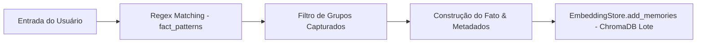

# Documentação Técnica: Atualizador e Extrator de Fatos (`.kamila/core/memory_updater.py`)

Esta documentação descreve em detalhes o funcionamento do módulo **`memory_updater.py`**, representado pela classe `MemoryUpdater`. Este componente é responsável por realizar a **extração automática e implícita de fatos pessoais** da fala do usuário para gravação permanente na memória de longo prazo (ChromaDB).

---

## 1. Visão Geral da Arquitetura

O `MemoryUpdater` analisa o texto digitado ou falado pelo usuário sem a necessidade de comandos explícitos, identificando padrões de declaração pessoal como nome, gostos e aversões.



---

## 2. Padrões de Expressões Regulares (`fact_patterns`)

O dicionário `self.fact_patterns` define as regras de extração contínua:

| Chave | Padrão Regex | Exemplos de Frases Capturadas |
| :--- | :--- | :--- |
| **`name`** | `r"meu nome é (\w+)\|pode me chamar de (\w+)\|eu sou o? (\w+)"` | *"Meu nome é Kaue"*, *"Pode me chamar de Carlos"*, *"Eu sou o Pedro"*. |
| **`preference_like`** | `r"eu (gosto\|adoro\|amo) (de\|muito de)? (.+)"` | *"Eu gosto de café sem açúcar"*, *"Eu amo programar em Python"*. |
| **`preference_dislike`** | `r"eu (não gosto\|odeio\|detesto) (de)? (.+)"` | *"Eu não gosto de barulho alto"*, *"Eu odeio acordar cedo"*. |

---

## 3. Detalhamento dos Métodos

### 3.1 Construtor (`__init__`)
```python
def __init__(self, embedding_store: EmbeddingStore):
    self.store = embedding_store
```
- Recebe a instância do `EmbeddingStore` onde os novos fatos serão salvos.

---

### 3.2 Processamento de Fatos (`process_and_save_facts`)
```python
def process_and_save_facts(self, user_input: str):
```

#### Passo a Passo da Execução:
1. **Iteração de Padrões**: Percorre as regras definidas em `fact_patterns`.
2. **Filtragem de Captura**: Localiza o grupo correspondente que contém o fato real, ignorando conectivos ou verbos auxiliares de busca (ex: *"gosto"*, *"adoro"*).
3. **Formatação do Fato e Metadados**:
   - **Caso de Nome**:
     - Fato: `"O nome do usuário é <nome>."`
     - Metadados: `{"type": "user_profile", "key": "name"}`
   - **Caso de Preferências**:
     - Fato: `"O usuário <tipo_de_preferencia>: <detalhe>."`
     - Metadados: `{"type": "preference", "content": "<detalhe>"}`
4. **Gravação no ChromaDB**: Invoca `self.store.add_memories(facts_to_save, metadatas_to_save)` para salvar os vetores em lote.

---

## 4. Integração Assíncrona

No módulo `MemoryManager`, o método `process_and_save_facts` é disparado através de uma **thread background (daemon)**:

```python
update_thread = threading.Thread(
    target=self.updater.process_and_save_facts,
    args=(user_input,)
)
update_thread.daemon = True
update_thread.start()
```

Essa abordagem garante que a geração de embeddings e inserção no banco de dados não afete o tempo de resposta ou a síntese de voz da assistente.
