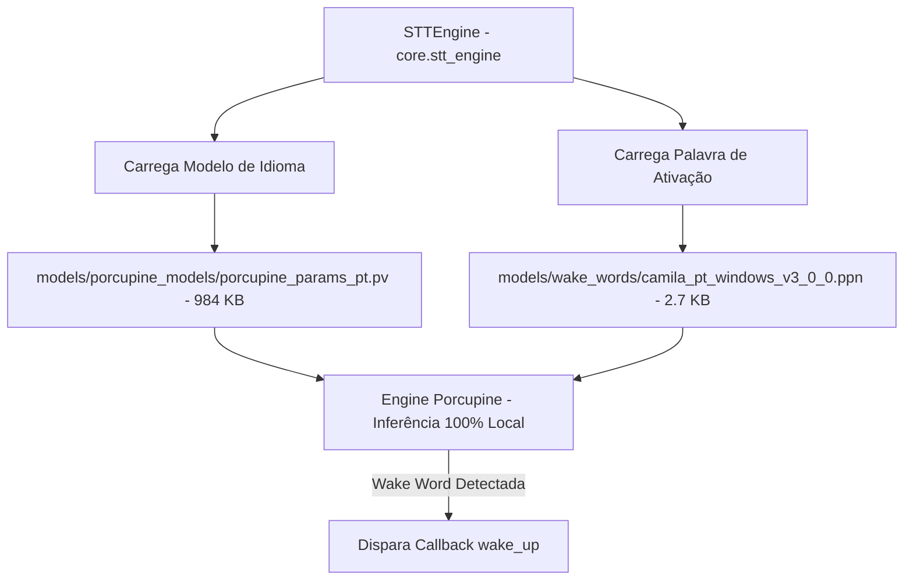

# Documentação Técnica: Diretório de Modelos Binários de Voz (`models/`)

Esta documentação descreve a estrutura, o funcionamento e a função dos modelos de inteligência artificial locais armazenados no diretório **`models/`**, localizado na raiz do projeto `models/`. Este diretório armazena os **binários de rede neural e palavras-chave de ativação** utilizados pela biblioteca Picovoice Porcupine.

---

## 1. Visão Geral da Arquitetura

O diretório `models/` é o núcleo do sistema de **escuta passiva offline de ultra-baixa latência** da assistente **Kamila**. Ele permite que o microfone escute continuamente a palavra *"kamila"* sem enviar fluxos de áudio para a nuvem.



---

## 2. Conteúdo e Especificações dos Arquivos

### 2.1 `models/porcupine_models/porcupine_params_pt.pv`
- **Formato**: Binário proprietário de parâmetros de rede neural Picovoice (`.pv`).
- **Tamanho**: ~984 KB (984.269 bytes).
- **Descrição**: Modelo acústico e fonético treinado para o idioma **Português do Brasil (`pt-BR`)**. Permite o reconhecimento preciso de consoantes, vogais e acentuação da língua portuguesa.

---

### 2.2 `models/wake_words/camila_pt_windows_v3_0_0.ppn`
- **Formato**: Binário compilado de palavra-chave Porcupine (`.ppn`).
- **Tamanho**: ~2.7 KB (2.744 bytes).
- **Plataforma Target**: Windows (Arquitetura x86_64, versão do motor v3.0.0).
- **Descrição**: Modelo de palavra-chave especificamente treinado para detectar a pronúncia *"Camila"* / *"Kamila"*. Possui alta sensibilidade e baixíssima taxa de falsos positivos em ambientes ruidosos.

---

## 3. Como os Arquivos São Utilizados no Código Python

No módulo `core/stt_engine.py`, os modelos são carregados via `pvporcupine`:

```python
import pvporcupine

porcupine = pvporcupine.create(
    access_key=os.getenv('PICOVOICE_API_KEY'),
    keyword_paths=['models/wake_words/camila_pt_windows_v3_0_0.ppn'],
    model_path='models/porcupine_models/porcupine_params_pt.pv'
)
```

---

## 4. Benefícios Arquiteturais

1. **Privacidade Total**: O processamento da palavra de ativação ocorre 100% na CPU local. Nenhum dado de áudio sai do computador até que a palavra *"kamila"* seja detectada.
2. **Desempenho Real-Time**: Latência de resposta inferior a 50 milissegundos.
3. **Baixo Consumo**: Ocupa menos de 10 MB de memória RAM durante a execução contínua.
