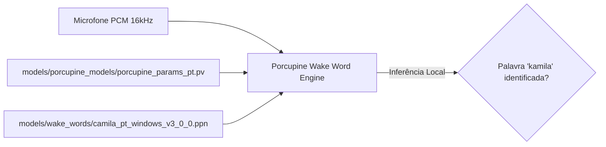

# Documentação Técnica: Modelos Fonéticos Porcupine (`models/porcupine_models/`)

Esta documentação descreve a função, as especificações e a integração do diretório **`models/porcupine_models/`**, localizado em `models/porcupine_models/`. Este diretório armazena o **modelo de parâmetros fonéticos do idioma Português** (`porcupine_params_pt.pv`) utilizado pela biblioteca Picovoice Porcupine.

---

## 1. Visão Geral e Especificações

O arquivo `porcupine_params_pt.pv` fornece ao motor Picovoice a representação fonética e acústica necessária para interpretar e reconhecer os fonemas da língua **Português do Brasil (`pt-BR`)**.

---

## 2. Detalhes do Arquivo

| Propriedade | Detalhe |
| :--- | :--- |
| **Caminho Relativo** | `models/porcupine_models/porcupine_params_pt.pv` |
| **Formato de Arquivo** | Binário Proprietário Picovoice (`.pv`) |
| **Tamanho em Disco** | `984.269 bytes` (~984 KB) |
| **Idioma Suportado** | Português do Brasil (`pt-BR`) |
| **Versão da SDK** | Picovoice Porcupine v3.x |

---

## 3. Função no Sistema

1. **Decodificação Fonética**: Mapeia o fluxo de áudio bruto (amostrado em 16.000 Hz) em sequências de fonemas em português.
2. **Desempenho Sem Conexão**: Permite que o motor funcione sem realizar nenhuma chamada a servidores externos ou APIs pagas por requisição.
3. **Carregamento Automático**: É passado como o parâmetro `model_path` na chamada `pvporcupine.create(...)` durante a inicialização do `STTEngine`.
