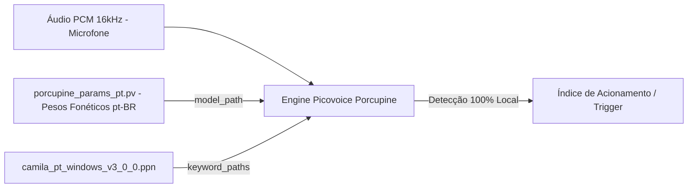

# Documentação Técnica: Parâmetros Acústicos em Português (`models/porcupine_models/porcupine_params_pt.pv`)

Esta documentação descreve as especificações técnicas e o papel do arquivo binário **`porcupine_params_pt.pv`**, localizado em `models/porcupine_models/porcupine_params_pt.pv`. Este ativo é o **modelo acústico fonético em Português do Brasil** utilizado pela biblioteca Picovoice Porcupine para a inferência local da palavra de ativação.

---

## 1. Visão Geral e Especificações do Ativo

O `porcupine_params_pt.pv` contém os pesos da rede neural profunda treinada pela Picovoice para converter amostras de áudio brutas em representações fonéticas em Português (`pt-BR`).



---

## 2. Ficha Técnica

| Parâmetro | Valor |
| :--- | :--- |
| **Caminho Relativo** | `models/porcupine_models/porcupine_params_pt.pv` |
| **Tipo de Arquivo** | Binário de Modelo Acústico Proprietário (`.pv`) |
| **Tamanho Exato** | `984.269 bytes` (~961 KB) |
| **Variante Fonética** | Português do Brasil (`pt-BR`) |
| **Frequência de Amostragem Exigida** | `16.000 Hz` (16 kHz, 16-bit Mono PCM) |
| **Compatibilidade da SDK** | Picovoice Porcupine Engine v3.0+ |

---

## 3. Integração com o Código Python

No módulo `core.stt_engine` (`.kamila/core/stt_engine.py`), este modelo é instanciado através do parâmetro `model_path`:

```python
self.porcupine = pvporcupine.create(
    access_key=self.picovoice_api_key,
    keyword_paths=[keyword_file_path],
    model_path='models/porcupine_models/porcupine_params_pt.pv'
)
```

---

## 4. Vantagens de Desempenho

1. **Inferência Off-Grid**: Operação 100% desconectada da internet.
2. **Latência Mínima**: Permite avaliar cada bloco de 512 amostras de áudio em menos de 1 milissegundo em CPUs convencionais.
3. **Imunidade a Ruídos**: Treinado para ignorar conversas de fundo que não contenham a palavra-chave cadastrada.
