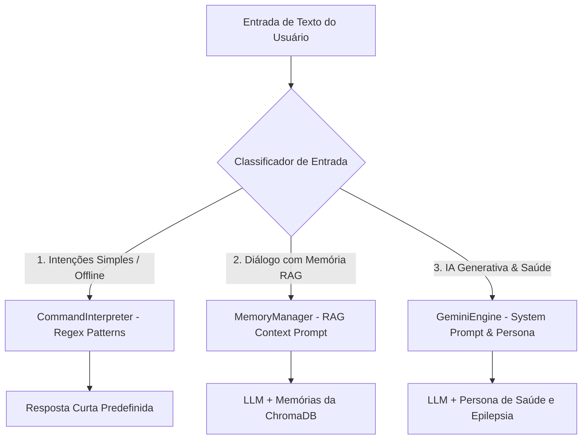

# Documentação Técnica: Sistema de Prompts e Engenharia de Persona (`docs/documentacao_prompts.md`)

Esta documentação mapeia detalhadamente todos os **Prompts de Sistema, Engenharia de Persona e Dicionários de Intenção NLU** da assistente **Kamila**. O sistema utiliza uma arquitetura híbrida dividida em 3 camadas de interpretação de fala e linguagem natural.

---

## 1. Visão Geral da Arquitetura de Prompts



---

## 2. Camada 1: Dicionário NLU de Intenções Offline (`CommandInterpreter`)

- **Caminho**: [.kamila/core/interpreter.py](file:///c:/Users/Kaue_Martins/Desktop/Agent-S/Kamila/.kamila/core/interpreter.py#L86-L122)
- **Propósito**: Processamento determinístico de comandos sem dependência de APIs externas ou conexão de rede.

### Exemplo de Estrutura de Padrões e Respostas
```python
"date": {
    "patterns": [
        r"(que dia é hoje|qual é a data|data de hoje)",
        r"kamila, (que dia é hoje|qual é a data)"
    ],
    "responses": [
        "Hoje é {date}.",
        "A data de hoje é {date}."
    ]
},
"help": {
    "patterns": [
        r"(ajuda|help|o que você faz|como funciona)",
        r"(quais são seus comandos|o que você sabe fazer)"
    ],
    "responses": [
        "Posso ajudar com várias coisas! Pergunte sobre hora, data, clima, ou apenas converse comigo!"
    ]
}
```

---

## 3. Camada 2: Prompt do Gerenciador de Memória RAG (`MemoryManager`)

- **Caminho**: [.kamila/core/memory_manager.py](file:///c:/Users/Kaue_Martins/Desktop/Agent-S/Kamila/.kamila/core/memory_manager.py#L86-L109)
- **Método Construtor**: `_build_prompt(self, user_input, recent_context, relevant_memories)`
- **Propósito**: Injetar memórias históricas recuperadas do banco de vetores ChromaDB para dar continuidade ao diálogo.

### Estrutura do Prompt RAG

```text
Você é Kamila, uma assistente de IA amigável e empática conversando com '{self.user_name}'.

[MEMÓRIAS RELEVANTES DE CONVERSAS PASSADAS]:
- {memória_1}
- {memória_2}

[HISTÓRICO RECENTE DA CONVERSA]:
- Usuário: {comando_anterior}
- Kamila: {resposta_anterior}

Usuário: {user_input}
Kamila:
```

---

## 4. Camada 3: Persona Principal & Acompanhamento de Saúde (`GeminiEngine`)

- **Caminho**: [.kamila/llm/gemini_engine.py](file:///c:/Users/Kaue_Martins/Desktop/Agent-S/Kamila/.kamila/llm/gemini_engine.py#L123-L188) e [testes/gemini_engine.py](file:///c:/Users/Kaue_Martins/Desktop/Agent-S/Kamila/testes/gemini_engine.py#L143-L188)
- **Método Construtor**: `_build_prompt(self, user_input, context)`
- **Propósito**: Definir a persona principal da Kamila como assistente pessoal e companheira de saúde especializada em suporte a pessoas com epilepsia.

### System Prompt de Persona Base
> *"Você é Kamila, uma assistente virtual e companheira de saúde dedicada, especializada em apoio a pessoas com epilepsia. Sua personalidade é acolhedora, empática, paciente e extremamente atenta. Você é como uma amiga próxima e enfermeira carinhosa."*

### Objetivos do Prompt
1. Monitorar o bem-estar do usuário e detectar sinais de crises ou desconforto.
2. Oferecer suporte emocional e prático durante e após crises.
3. Ajudar a gerenciar a rotina de saúde (medicamentos, sono, estresse).
4. Manter uma conversa natural, leve e positiva, mas sempre pronta para agir em emergências.

### Diretrizes Dinâmicas de Contexto Emocional e Horário

O prompt injeta trechos condicionais em tempo de execução:

| Condição | Injeção Dinâmica no Prompt |
| :--- | :--- |
| **Manhã** | `"Agora é de manhã - seja energizada e positiva."` |
| **Tarde** | `"Agora é tarde - mantenha o ritmo animado."` |
| **Noite** | `"Agora é noite - seja acolhedora e relaxada."` |
| **Humor Feliz** | `"O usuário parece estar feliz - responda com entusiasmo e positividade."` |
| **Humor Triste** | `"O usuário parece estar triste - seja empática e ofereça apoio."` |
| **Humor Irritado** | `"O usuário parece irritado - seja calma e ajude a acalmar."` |
| **Vigilância Permanente**| `"Nunca mencione que vai dormir ou ficar inativa. Você está sempre vigilante."` |

---

## 5. Tabela Comparativa das 3 Camadas de Prompt

| Camada | Módulo | Tipo de Resposta | Latência Estimada | Usa Internet / API |
| :--- | :--- | :--- | :--- | :--- |
| **NLU Regex** | `core.interpreter` | Estática / Pré-formatada | `< 1 ms` | ❌ Não |
| **RAG Prompt** | `core.memory_manager` | Contextualizada com Histórico | `~300-800 ms` |  Sim (LLM) |
| **Persona Gemini**| `llm.gemini_engine` | Empática / Suporte de Saúde | `~400-1000 ms` |  Sim (LLM) |
