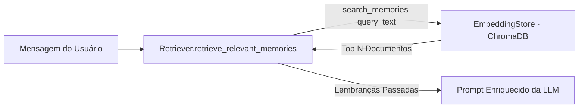

# Documentação Técnica: Recuperador Semântico de Memória (`.kamila/core/retriever.py`)

Esta documentação detalha o funcionamento do módulo **`retriever.py`**, representado pela classe `Retriever`. Este componente implementa a camada de consulta da arquitetura **RAG (Retrieval-Augmented Generation)** da assistente **Kamila**, resgatando memórias de longo prazo relevantes para o contexto atual do diálogo.

---

## 1. Visão Geral da Arquitetura

O `Retriever` intercepta a mensagem do usuário antes que ela chegue ao modelo de linguagem, buscando no banco vetorial ChromaDB os fatos e contextos passados que possuem similaridade semântica com o assunto abordado.



---

## 2. Detalhamento dos Métodos da Classe `Retriever`

### 2.1 Construtor (`__init__`)
```python
def __init__(self, embedding_store: EmbeddingStore):
    self.store = embedding_store
```
- **Descrição**: Inicializa o componente armazenando a referência da instância de persistência vetorial `EmbeddingStore`.

---

### 2.2 Recuperação de Memórias (`retrieve_relevant_memories`)

```python
def retrieve_relevant_memories(self, current_input: str, n_memories: int = 3) -> List[str]:
```

#### Fluxo de Execução:
1. **Log de Diagnóstico**: Exibe no console os primeiros 50 caracteres da entrada do usuário para auditoria em tempo real (`[Retriever] Buscando memórias relevantes para: ...`).
2. **Consulta Vetorial**: Delega a busca de similaridade ao método `self.store.search_memories(query_text=current_input, n_results=n_memories)`.
3. **Auditoria de Resultados**: Se memórias forem encontradas, exibe a lista resgatada nos logs do sistema.
4. **Retorno**: Retorna a lista de strings com os fatos resgatados.

---

## 3. Papel na Arquitetura RAG da Assistente

No módulo `MemoryManager`, o retorno do `Retriever` é formatado e inserido diretamente na seção de contexto histórico do prompt da IA:

```text
---
Lembranças Relevantes do Passado (use-as se fizerem sentido para a conversa):
- O nome do usuário é Kaue.
- O usuário gosta de programar em Python.
```

Essa abordagem garante que a assistente lembre de fatos antigos sem precisar carregar todo o histórico de conversas passadas na janela de contexto da LLM, reduzindo consumo de tokens e evitando alucinações.
