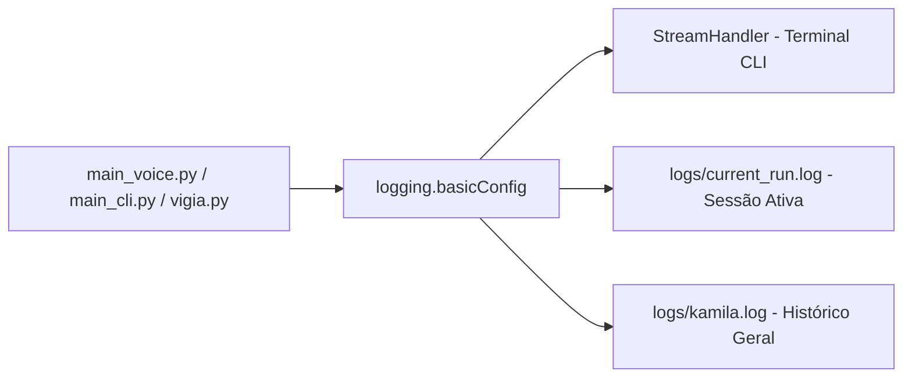

# Documentação Técnica: Diretório Raiz de Telemetria e Logs (`logs/`)

Esta documentação descreve o funcionamento, a estrutura e a política de manutenção do diretório **`logs/`**, localizado na raiz do projeto `logs/`. Este diretório é utilizado pelas interfaces de nível superior da assistente **Kamila** (`main_voice.py`, `main_cli.py`, `desbloqueio_facial.py` e `vigia.py`) para gravação contínua de telemetria, diagnóstico de falhas e auditoria de sessão.

---

## 1. Visão Geral da Arquitetura

O sistema de logs grava em tempo real eventos operacionais em dois arquivos principais de diagnóstico, garantindo rastreabilidade da sessão corrente e histórico de longa duração.



---

## 2. Conteúdo e Especificação dos Arquivos

| Arquivo | Tamanho | Descrição |
| :--- | :--- | :--- |
| **`logs/current_run.log`** | ~2.3 KB | Contém a telemetria da sessão atual em execução. É sobrescrito ou atualizado a cada nova inicialização da assistente. |
| **`logs/kamila.log`** | ~632 KB | Registra o histórico completo acumulado de execuções, reconhecimentos de voz, comandos acionados e diagnósticos de exceções. |

---

## 3. Padrão de Formatação dos Registros

Os registros seguem o padrão estruturado:

```text
YYYY-MM-DD HH:MM:SS,mmm - nome_do_modulo - NÍVEL_DE_LOG - Mensagem do Evento
```

### Exemplo de Log em `current_run.log`:
```text
2026-07-23 20:10:01,234 - __main__ - INFO - 🚀 Inicializando Kamila Voice Interface...
2026-07-23 20:10:02,567 - main_voice - INFO - Conectado ao serviço de síntese de voz.
2026-07-23 20:10:05,890 - main_voice - INFO - Palavra de ativação 'kamila' detectada.
2026-07-23 20:10:08,123 - main_voice - INFO - Processando comando: 'abrir navegador'
```

---

## 4. Segurança e Git Hygiene

> [!NOTE]
> **Privacidade & Git Hygiene**: Todos os arquivos `*.log` do diretório `logs/` contêm registros de auditoria em tempo real das interações do usuário. Por esse motivo, estão estritamente incluídos no arquivo `.gitignore` (`*.log`) e **não são enviados para o repositório remoto Git**.
