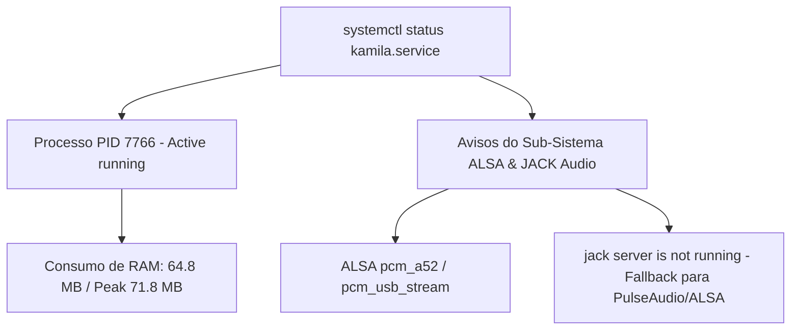

# Documentação Técnica: Log de Diagnóstico do Serviço (`scripts/udo apt-get install mpg123`)

Esta documentação descreve o conteúdo e o propósito do arquivo de log **`udo apt-get install mpg123`**, localizado em `scripts/udo apt-get install mpg123`. Apesar do nome atípico oriundo de um atalho de comando no terminal, este arquivo é um **registro de diagnóstico de saída do `systemctl status`**, capturado durante a inicialização em segundo plano da assistente **Kamila** em ambiente Linux.

---

## 1. Visão Geral dos Dados Registrados

O arquivo armazena a saída com códigos de cor ANSI do `systemctl status kamila.service`, demonstrando o consumo de recursos do processo Python e as mensagens de inicialização do subsistema de som ALSA e JACK Audio.

---

## 2. Detalhamento das Informações do Serviço

| Métrica / Campo | Valor Registrado | Descrição |
| :--- | :--- | :--- |
| **Nome da Unidade** | `kamila.service` | Serviço de usuário em `~/.config/systemd/user/kamila.service`. |
| **Estado do Serviço** | `active (running)` | O daemon da Kamila foi iniciado e está operacional. |
| **PID Principal** | `7766` | Identificador do processo Python no sistema operacional. |
| **Uso de Memória** | `64.8 MB` (pico: `71.8 MB`) | Demonstra baixíssimo consumo de memória RAM. |
| **Comando Executado** | `/opt/kamila/venv/bin/python3 .../.kamila/main.py` | Execução do ambiente virtual isolado em `/opt/kamila`. |

---

## 3. Diagnóstico de Áudio (ALSA / JACK Audio)

As linhas 12 a 21 registram o comportamento dos drivers de áudio do Linux:

- **`ALSA lib pcm_a52.c ... a52 is only for playback`**: Avisos informativos normais do driver ALSA ao enumerar placas de som digitais.
- **`jack server is not running or cannot be started`**: Indica que o servidor de áudio profissional JACK não está em execução. A Kamila realiza o *fallback* automático para o ALSA/PulseAudio, mantendo a captura e reprodução de voz 100% funcionais.
