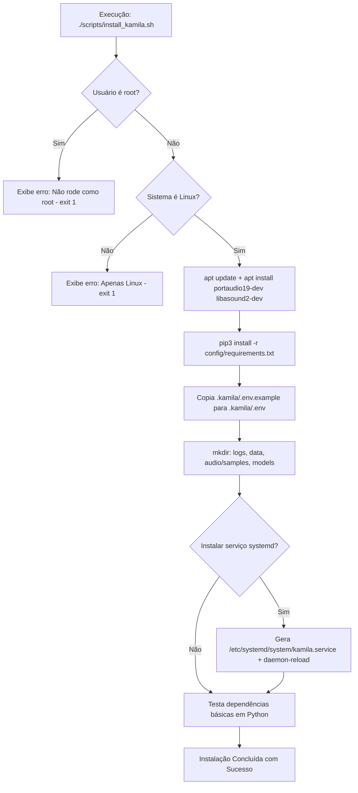

# Documentação Técnica: Script de Instalação do Ecossistema Kamila (`scripts/install_kamila.sh`)

Esta documentação descreve as etapas, o funcionamento e as verificações do script Bash **`install_kamila.sh`**, localizado no diretório `scripts/install_kamila.sh`. Este utilitário automatiza o provisionamento completo da assistente **Kamila** em distribuições Linux (Ubuntu/Debian).

---

## 1. Visão Geral da Arquitetura de Instalação

O `scripts/install_kamila.sh` é um assistente interativo de instalação que verifica privilégios de usuário, atualiza repositórios do sistema, instala bibliotecas C de áudio (PortAudio, ALSA), configura variáveis `.env`, gera a estrutura de pastas e oferece o provisionamento opcional do serviço `systemd`.



---

## 2. Como Executar o Script

No terminal Linux, torne o script executável e execute:

```bash
chmod +x scripts/install_kamila.sh
./scripts/install_kamila.sh
```

---

## 3. Detalhamento das Travas de Segurança e Etapas

### 3.1 Proteção Contra Execução como Root
```bash
if [[ $EUID -eq 0 ]]; then
   echo "⚠️ AVISO: Não execute este script como root!"
   exit 1
fi
```
Impede a execução com `sudo` direto para garantir que o ambiente virtual e as variáveis de usuário sejam atribuídas à pasta `HOME` do usuário não-root correto.

---

### 3.2 Pacotes de Sistema Operacional (`apt` e `pip3`)
- **`portaudio19-dev` & `libasound2-dev`**: Headers e bibliotecas de desenvolvimento C/C++ necessárias para compilar a extensão Python `PyAudio`.
- **`config/requirements.txt`**: Instala a pilha de bibliotecas Python do projeto.

---

### 3.3 Estrutura de Diretórios e Permissões
Gera a árvore de suporte da aplicação:
```bash
mkdir -p logs data audio/samples models/wake_words models/porcupine_models
chmod +x .kamila/main.py
```

---

### 3.4 Gerador Interativo de Unidade `systemd`
Se o usuário confirmar a opção (`y`), o script escreve dinamicamente a unidade `/etc/systemd/system/kamila.service` utilizando as variáveis de ambiente atuais (`User=$USER`, `WorkingDirectory=$PWD`) e ativa o serviço via `systemctl enable`.
