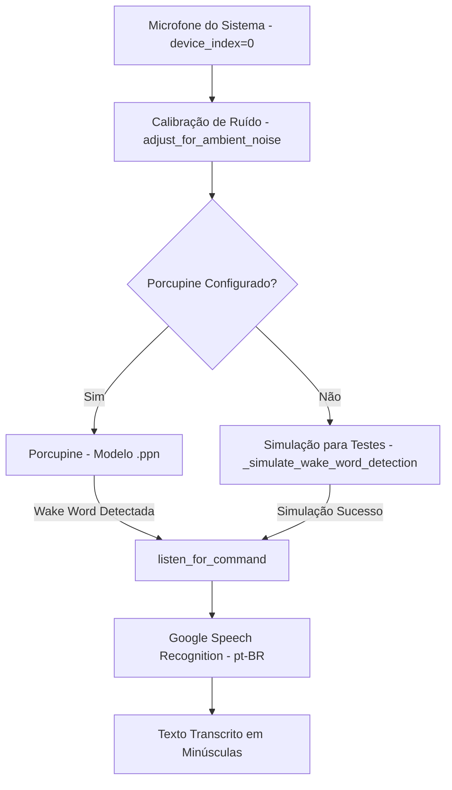

# Documentação Técnica: Motor de Fala para Texto Corrigido (`.kamila/core/stt_engine_corrected.py`)

Esta documentação descreve em detalhes o funcionamento do módulo **`stt_engine_corrected.py`**, representado pela classe `STTEngine`. Este componente é uma **variante funcional simplificada do motor de Speech-to-Text (STT)** da assistente **Kamila**, responsável pela escuta da palavra de ativação (*Wake Word*) e transcrição de áudio em linguagem natural.

---

## 1. Visão Geral da Arquitetura

O `stt_engine_corrected.py` conecta a captura de áudio do sistema operacional via `SpeechRecognition` com o mecanismo de palavra-chave **Picovoice Porcupine** em um formato sequencial síncrono.

---

## 2. Estrutura e Atributos da Classe `STTEngine`

### 2.1 Parâmetros de Áudio (`__init__`)
- **`self.recognizer`**: Instância principal da biblioteca `speech_recognition.Recognizer`.
- **`self.microphone`**: Dispositivo de áudio capturado via `sr.Microphone(device_index=0)`.
- **`self.porcupine`**: Instância do motor Picovoice Porcupine.
- **Configurações de Sensibilidade de Áudio**:
  - `self.energy_threshold = 300`: Limiar de energia de entrada do microfone.
  - `self.pause_threshold = 0.8`: Tempo em segundos de silêncio para considerar o fim da frase.
  - `self.dynamic_energy_threshold = True`: Ajuste automático dinâmico do limiar de energia conforme o ruído da sala.

---

## 3. Detalhamento dos Métodos

### 3.1 `_setup_microphone()`
- Lista os microfones disponíveis no sistema via `sr.Microphone.list_microphone_names()`.
- Seleciona o microfone padrão (índice `0`).
- Calibra o microfone por 1 segundo com `adjust_for_ambient_noise(source, duration=1)`.

---

### 3.2 `_setup_porcupine()`
- Lê a chave de API `PICOVOICE_API_KEY` do arquivo `.env`.
- Carrega o modelo de palavra-chave nativo em português: `models/wake_words/camila_pt_windows_v3_0_0.ppn`.
- Utiliza a biblioteca `pvporcupine.create` para instanciar a detecção da Wake Word *"Kamila"*.

---

### 3.3 `detect_wake_word(wake_word="kamila", timeout=10) -> bool`
- Aguarda a palavra de ativação ser pronunciada dentro do tempo limite (10 segundos).
- **Mecanismo de Fallback**: Se o Porcupine não estiver configurado ou falhar, ativa o método `_simulate_wake_word_detection()`, permitindo que testes sintéticos e de integração continuem funcionando sem hardware de áudio ativo.

---

### 3.4 `listen_for_command(timeout=5) -> Optional[str]`
- Abre o microfone e aguarda o comando de voz do usuário por até 5 segundos.
- Envia o buffer de áudio capturado para o serviço Google STT (`recognize_google`) com idioma configurado em Português do Brasil (`pt-BR`).
- **Tratamento de Exceções**:
  - `sr.UnknownValueError`: Retorna `None` e loga `"Comando não entendido"` caso o usuário fique em silêncio ou haja apenas ruído.
  - `sr.RequestError`: Trata erros de requisição ou falta de conexão com a API de voz.
- Retorna o texto transcrito formatado em minúsculas (`command.lower()`).

---

### 3.5 `cleanup()`
- Método de liberação de recursos de hardware. Executa `self.porcupine.delete()` para liberar a memória e as instâncias C do Porcupine.

---

## 4. Comparação com o `stt_engine.py` Principal

| Recurso | `stt_engine_corrected.py` (Variante) | `stt_engine.py` (Principal) |
| :--- | :--- | :--- |
| **Execução** | Síncrona e direta | Assíncrona com `ThreadPoolExecutor` e Threads |
| **Foco** | Testes de bancada, scripts simples e validação | Produção, streaming e alta concorrência |
| **Simulação** | Possui `_simulate_wake_word_detection` | Foco em dispositivos de áudio reais via PyAudio |
