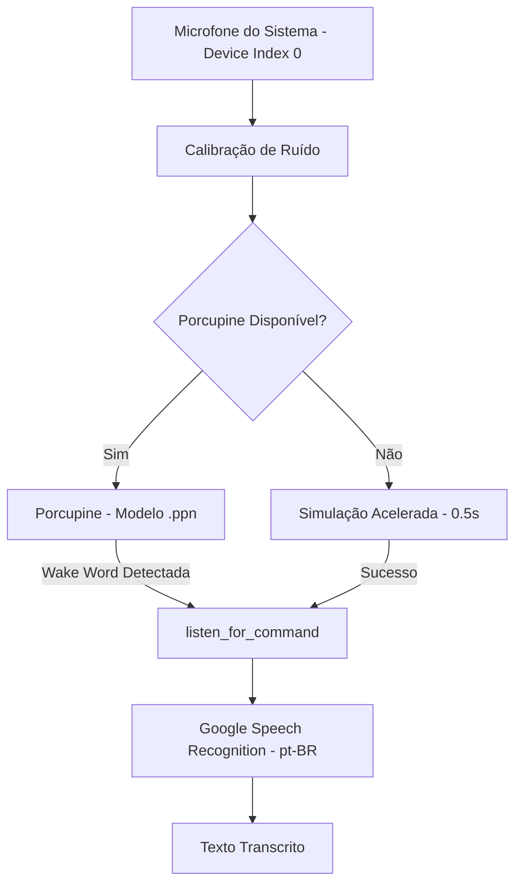

# Documentação Técnica: Motor de Fala para Texto Ajustado (`.kamila/core/stt_engine_fixed.py`)

Esta documentação descreve em detalhes o funcionamento do módulo **`stt_engine_fixed.py`**, representado pela classe `STTEngine`. Este componente é uma **variante otimizada para testes rápidos** do motor de Speech-to-Text (STT) da assistente **Kamila**.

---

## 1. Visão Geral da Arquitetura

O `stt_engine_fixed.py` oferece uma implementação síncrona com ajustes de baixa latência para rotinas de testes de unidade e automações sem atraso de hardware.

---

## 2. Estrutura e Atributos da Classe `STTEngine`

### 2.1 Parâmetros de Áudio (`__init__`)
- **`self.recognizer`**: Instância principal da biblioteca `speech_recognition.Recognizer`.
- **`self.microphone`**: Dispositivo de captura via `sr.Microphone(device_index=0)`.
- **`self.porcupine`**: Motor Picovoice Porcupine para a palavra de ativação *"Kamila"*.
- **Configurações de Sensibilidade**:
  - `self.energy_threshold = 300`
  - `self.pause_threshold = 0.8`
  - `self.dynamic_energy_threshold = True`

---

## 3. Detalhamento dos Métodos

### 3.1 `_setup_microphone()`
- Inicializa o dispositivo de entrada e aplica o filtro de ajuste de ruído ambiente `adjust_for_ambient_noise(source, duration=1)`.

### 3.2 `_setup_porcupine()`
- Lê a chave `PICOVOICE_API_KEY` da `.env` e carrega o modelo binário de palavra de ativação `models/wake_words/camila_pt_windows_v3_0_0.ppn`.

### 3.3 `detect_wake_word(wake_word="kamila", timeout=10) -> bool`
- Realiza a escuta da palavra-chave.
- **Ajuste de Desempenho (`_simulate_wake_word_detection`)**: Reduz a pausa de simulação para **0.5 segundos** (diferente da versão `corrected` que utiliza 2.0 segundos), garantindo maior velocidade na suíte de testes do projeto.

### 3.4 `listen_for_command(timeout=5) -> Optional[str]`
- Ouve a frase e executa o reconhecimento de fala via Google STT em Português (`pt-BR`).
- Retorna a string em minúsculas ou `None` em caso de erro/silêncio.

### 3.5 `cleanup()`
- Executa `self.porcupine.delete()` garantindo a desalocação do motor nativo Picovoice.
