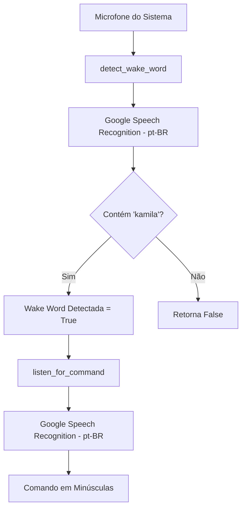

# Documentação Técnica: Motor de Fala para Texto via Google (`.kamila/core/stt_engine_google.py`)

Esta documentação descreve em detalhes o funcionamento do módulo **`stt_engine_google.py`**, representado pela classe `STTEngine`. Este componente é uma **variante puramente baseada em nuvem** do motor de Speech-to-Text (STT) da assistente **Kamila**, utilizando exclusivamente o serviço **Google Speech Recognition** tanto para a transcrição de frases quanto para a detecção da palavra de ativação (*Wake Word*).

---

## 1. Visão Geral da Arquitetura

Diferente da versão principal (que utiliza o motor local Picovoice Porcupine), esta versão não exige arquivos binários `.ppn` ou bibliotecas C de baixa nível. A palavra de ativação *"Kamila"* é identificada por análise de substring na transcrição devolvida pelo Google.

---

## 2. Estrutura e Atributos da Classe `STTEngine`

### 2.1 Configurações de Entrada (`__init__`)
- **`self.recognizer`**: Instância de `speech_recognition.Recognizer()`.
- **`self.microphone`**: Dispositivo de áudio capturado via `sr.Microphone(device_index=0)`.
- **Configurações de Sensibilidade**:
  - `self.energy_threshold = 300`: Limiar de energia sonora.
  - `self.pause_threshold = 0.8`: Intervalo de silêncio para corte de áudio.
  - `self.dynamic_energy_threshold = True`: Ajuste automático dinâmico contra ruído da sala.

---

## 3. Detalhamento dos Métodos

### 3.1 `_setup_microphone()`
- Detecta os microfones conectados via `sr.Microphone.list_microphone_names()`.
- Define o dispositivo no índice `0` e ajusta a calibração por 1 segundo via `adjust_for_ambient_noise`.

---

### 3.2 `detect_wake_word(wake_word="kamila", timeout=10) -> bool`
- **Funcionamento**:
  1. Ouve o áudio do ambiente por até 10 segundos.
  2. Transcreve o bloco de áudio via `recognize_google(audio, language='pt-BR')`.
  3. Verifica se a palavra `"kamila"` está presente na transcrição (`if wake_word.lower() in command.lower()`).
  4. Retorna `True` se a palavra de ativação for dita, ou `False` se inaudível/desconhecida.

---

### 3.3 `listen_for_command(timeout=5) -> Optional[str]`
- Captura a frase falada pelo usuário após a ativação.
- Envia o áudio capturado para a API do Google Speech.
- Verifica se a variável `GOOGLE_API_KEY` existe no arquivo `.env` para utilizar cota própria ou fallback no endpoint público.
- Retorna a string transcrita em minúsculas (`command.lower()`).

---

### 3.4 `cleanup()`
- Método de encerramento simples sem necessidade de liberar ponteiros de memória C (como é exigido no Porcupine).

---

## 4. Comparativo de Motores STT

| Característica | `stt_engine.py` (Porcupine + STT) | `stt_engine_google.py` (Google puro) |
| :--- | :--- | :--- |
| **Detecção de Wake Word** | Local / Offline (Porcupine `.ppn`) | Online (Google Speech API) |
| **Latência de Ativação** | Ultra-baixa (~50ms) | Baixa (~500ms - depende da internet) |
| **Dependências Externas** | Requer `pvporcupine` e modelo `.ppn` | Depende apenas da biblioteca `SpeechRecognition` |
| **Consumo de CPU** | Muito Baixo | Baixo |
