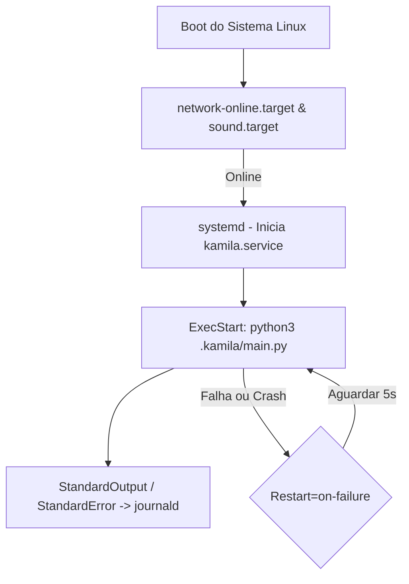

# Documentação Técnica: Serviço Daemon Systemd (`deployment/systemd/`)

Esta documentação descreve o funcionamento, a estrutura e os comandos do diretório **`deployment/systemd/`** e do arquivo de unidade **`kamila.service`**, localizado em `deployment/systemd/kamila.service`. Este componente permite que a assistente **Kamila** seja executada como um **serviço de segundo plano (daemon) no Linux**, garantindo inicialização automática no boot e alta disponibilidade.

---

## 1. Visão Geral da Arquitetura do Serviço

O `kamila.service` é registrado no gerenciador de serviços **systemd** do sistema operacional. Ele aguarda os subsistemas de rede e áudio estarem online antes de disparar o interpretador Python.



---

## 2. Conteúdo e Especificações do `kamila.service`

```ini
[Unit]
Description=Assistente Virtual Kamila
After=network-online.target sound.target

[Service]
Type=simple
User=martins
Group=martins
WorkingDirectory="/home/martins/Desktop/kamila_instalador_completo/kamila_avancada/.kamila"
ExecStart="/home/martins/Desktop/kamila_instalador_completo/venv/bin/python3" "/home/martins/Desktop/kamila_instalador_completo/kamila_avancada/.kamila/main.py"
Restart=on-failure
RestartSec=5s
StandardOutput=journal
StandardError=journal

[Install]
WantedBy=multi-user.target
```

---

## 3. Detalhamento dos Parâmetros de Configuração

### 3.1 Seção `[Unit]`
- **`Description`**: Nome amigável do serviço exibido no `systemctl status`.
- **`After=network-online.target sound.target`**: Evita erros de inicialização garantindo que as interfaces de rede (para chamadas ao Gemini/AI Studio) e os drivers de som (para microfone e alto-falante) estejam prontos.

### 3.2 Seção `[Service]`
- **`Type=simple`**: Indica que o processo iniciado pelo `ExecStart` é o processo principal do serviço.
- **`User` / `Group`**: Executa o processo sob as permissões do usuário `martins`.
- **`WorkingDirectory`**: Define a pasta de trabalho raiz onde o arquivo `.env` e as pastas de memória estão localizadas.
- **`ExecStart`**: Comando que especifica o executável do ambiente virtual Python e o arquivo `.kamila/main.py`.
- **`Restart=on-failure` & `RestartSec=5s`**: Mecanismo de autorecuperação que reinicia a Kamila automaticamente em 5 segundos caso ocorra uma exceção fatal ou queda de conexão.
- **`StandardOutput` / `StandardError`**: Envia os registros gerados pela biblioteca `logging` diretamente para o `journald`.

### 3.3 Seção `[Install]`
- **`WantedBy=multi-user.target`**: Define que o serviço deve ser ativado durante o nível de execução padrão do sistema (modo texto/gráfico multi-usuário).

---

## 4. Comandos de Gerenciamento do Serviço

| Operação | Comando Terminal |
| :--- | :--- |
| **Instalar o Serviço** | `sudo cp deployment/systemd/kamila.service /etc/systemd/system/` |
| **Recarregar Daemon** | `sudo systemctl daemon-reload` |
| **Habilitar no Boot** | `sudo systemctl enable kamila.service` |
| **Iniciar Assistente** | `sudo systemctl start kamila` |
| **Parar Assistente** | `sudo systemctl stop kamila` |
| **Reiniciar Assistente**| `sudo systemctl restart kamila` |
| **Verificar Status** | `sudo systemctl status kamila` |
| **Monitorar Logs (Ao Vivo)** | `journalctl -fu kamila` |
