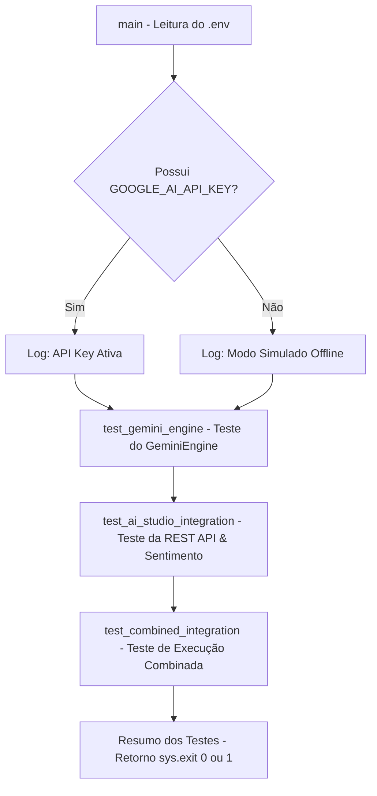

# Documentação Técnica: Suíte de Testes dos Módulos Gemini (`.kamila/llm/test_gemini_modules.py`)

Esta documentação descreve em detalhes a suíte de testes **`test_gemini_modules.py`**, localizada em `.kamila/llm/test_gemini_modules.py`. Este script é responsável pela **validação automatizada, auditoria de conexão e testes de fallback** dos motores de inteligência artificial generativa da assistente **Kamila**.

---

## 1. Visão Geral da Arquitetura de Testes

O `test_gemini_modules.py` executa 3 rotinas principais de verificação, garantindo que o sistema continue funcional tanto com conexão ativa com a Google API quanto em modo offline (simulado).



---

## 2. Como Executar a Suíte de Testes

No terminal ou virtualenv do projeto, execute:

```bash
python .kamila/llm/test_gemini_modules.py
```

---

## 3. Detalhamento das Funções de Teste

### 3.1 `test_gemini_engine() -> bool`
- **Componente Avaliado**: `GeminiEngine` (`.kamila/llm/gemini_engine.py`).
- **Verificações**:
  1. Consulta `get_model_info()` para validar se a API está online ou se o modo de simulação foi ativado.
  2. Envia 4 frases de teste (*"Olá!"*, *"Que horas são?"*, *"Conta uma piada"*, *"Obrigado"*).
  3. Valida se a resposta gerada não está vazia.

---

### 3.2 `test_ai_studio_integration() -> bool`
- **Componente Avaliado**: `AIStudioIntegration` (`.kamila/llm/ai_studio_integration.py`).
- **Verificações**:
  1. Chama `get_available_models()` e exibe a contagem de modelos ativos na conta Google.
  2. Executa a geração de texto HTTP REST em `generate_text()`.
  3. Testa o pipeline de NLU em `analyze_sentiment("Estou muito feliz hoje!")`, verificando a estrutura do dicionário de sentimento devolvido.

---

### 3.3 `test_combined_integration() -> bool`
- **Componente Avaliado**: Execução simultânea de ambos os clientes de IA.
- **Verificações**: Instancia o `GeminiEngine` e o `AIStudioIntegration` no mesmo processo para garantir que não existam colisões de escopo ou exceções de variáveis de ambiente.

---

## 4. Estrutura do Resumo e Códigos de Saída (`main`)

Ao final da execução, o script compila a tabela de resultados:

```text
============================================================
 RESUMO DOS TESTES
============================================================
Gemini Engine:  PASSOU
AI Studio Integration:  PASSOU
Combined Integration:  PASSOU

 Resultado Final: 3/3 testes passaram
 Todos os testes passaram! Módulos Gemini funcionando perfeitamente.
```

- **Código de Saída `0`**: Sucesso total. Todos os testes passaram.
- **Código de Saída `1`**: Falha detectada em um ou mais testes.
