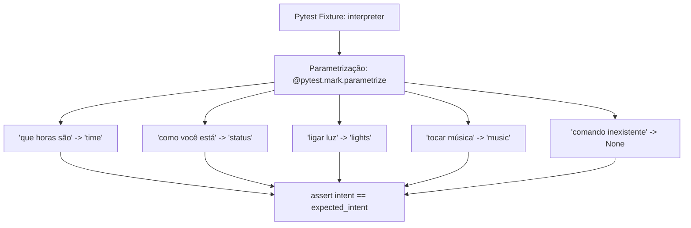

# Documentação Técnica: Teste de Unidade Pytest do NLU (`testes/test_interpreter_pytest.py`)

Esta documentação descreve o funcionamento e a estrutura do arquivo de teste de unidade **`test_interpreter_pytest.py`**, localizado em `testes/test_interpreter_pytest.py`. Este módulo utiliza o framework **`pytest`** para validar a classificação de intenções do interpretador de comandos em linguagem natural (`CommandInterpreter`).

---

## 1. Visão Geral da Arquitetura do Teste

O `test_interpreter_pytest.py` utiliza os recursos de **fixtures** e **parametrização** do `pytest`, garantindo que múltiplos comandos sejam testados de forma limpa, isolada e reproduzível.



---

## 2. Código-Fonte Completo

```python
import pytest
from .kamila.core.interpreter import CommandInterpreter

@pytest.fixture
def interpreter():
    return CommandInterpreter()

@pytest.mark.parametrize("command, expected_intent", [
    ("que horas são", "time"),
    ("como você está", "status"),
    ("ligar luz", "lights"),
    ("tocar música", "music"),
    ("comando inexistente", None),
])
def test_interpret_command(interpreter, command, expected_intent):
    intent = interpreter.interpret_command(command)
    assert intent == expected_intent
```

---

## 3. Como Executar

No terminal, execute o runner do `pytest`:

```bash
pytest testes/test_interpreter_pytest.py
```
