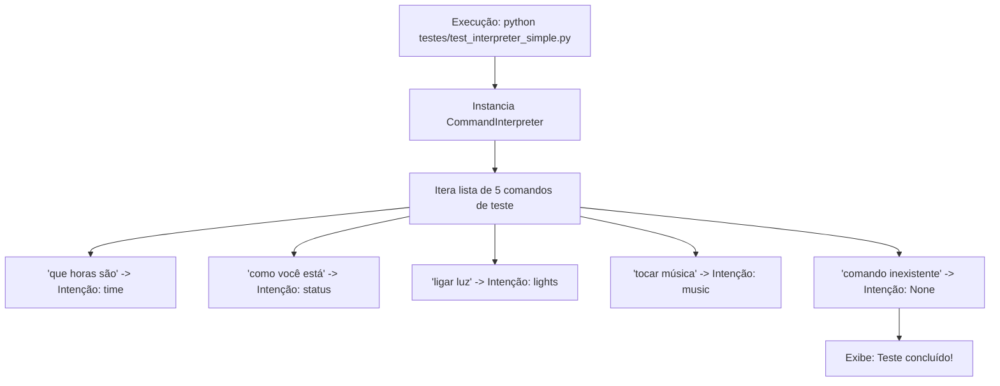

# Documentação Técnica: Teste Simplificado de NLU (`testes/test_interpreter_simple.py`)

Esta documentação descreve o funcionamento do script de teste **`test_interpreter_simple.py`**, localizado no diretório `testes/test_interpreter_simple.py`. Este módulo fornece uma **verificação rápida de bancada (*smoke test*)** para o interpretador de comandos em linguagem natural (`CommandInterpreter`).

---

## 1. Visão Geral do Código (`test_interpreter_simple.py`)

O script adiciona o diretório `.kamila` ao caminho do sistema (`sys.path.append('.kamila')`), instancia a classe `CommandInterpreter` e itera sobre uma lista de frases de teste, exibindo a intenção classificada no console.



---

## 2. Código-Fonte Completo

```python
#!/usr/bin/env python3
"""
Teste simples do Command Interpreter
"""

import sys
import os
sys.path.append('.kamila')

from core.interpreter import CommandInterpreter

def test_interpreter():
    print("🧠 Testando Command Interpreter...")

    # Inicializar interpreter
    interpreter = CommandInterpreter()

    # Testar comandos
    commands = [
        'que horas são',
        'como você está',
        'ligar luz',
        'tocar música',
        'comando inexistente'
    ]

    print("\n📝 Resultados:")
    for cmd in commands:
        intent = interpreter.interpret_command(cmd)
        print(f'Comando: "{cmd}" → Intenção: {intent}')

    print("\n✅ Teste concluído!")

if __name__ == "__main__":
    test_interpreter()
```

---

## 3. Como Executar

No terminal, execute:

```bash
python testes/test_interpreter_simple.py
```
