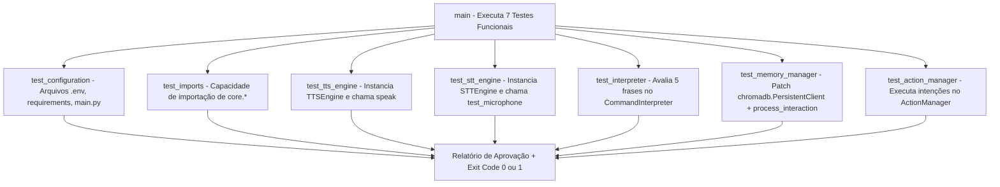

# Documentação Técnica: Suíte de Testes de Integração dos Motores Core (`testes/test_kamila.py`)

Esta documentação descreve o funcionamento e a arquitetura do script de teste **`test_kamila.py`**, localizado em `testes/test_kamila.py`. Este módulo realiza a **validação em tempo de execução dos 7 componentes fundamentais da assistente Kamila**, utilizando *mocks* para o banco de vetores ChromaDB e para o LLM.

---

## 1. Visão Geral da Suíte de Integração

O `test_kamila.py` é responsável por instanciar diretamente as classes de produção do pacote `core` e testar seus métodos funcionais.



---

## 2. Detalhamento dos 7 Casos de Teste

| Teste | Função | Descrição e Estratégia de Mock |
| :--- | :--- | :--- |
| **1. Configuração** | `test_configuration()` | Verifica se `.kamila/.env`, `config/requirements.txt` e `.kamila/main.py` existem. |
| **2. Importações** | `test_imports()` | Testa a importação dinâmica de todos os pacotes dentro de `.kamila/core/`. |
| **3. TTS Engine** | `test_tts_engine()` | Instancia `TTSEngine` e envia o texto *"Olá! Este é um teste da assistente Kamila."* para a fila de áudio. |
| **4. STT Engine** | `test_stt_engine()` | Testa a inicialização do reconhecedor de fala e a escuta do microfone (`stt.test_microphone()`). |
| **5. NLU Interpreter**| `test_interpreter()` | Testa o mapeamento de frases (*"oi kamila"*, *"que horas são"*, *"como está o tempo"*, *"qual é o seu nome"*, *"conta uma piada"*) para intenções e respostas. |
| **6. Memory Manager**| `test_memory_manager()` | Utiliza `unittest.mock.patch` no `chromadb.PersistentClient` para simular o armazenamento vetorial em memória sem depender do disco rígido, validando a atualização da chave `user_name = "Teste"`. |
| **7. Action Manager** | `test_action_manager()` | Executa um bloco de intenções (`greeting`, `time`, `name`, `joke`, `help`) no `ActionManager`. |

---

## 3. Como Executar

No terminal, execute:

```bash
python testes/test_kamila.py
```
