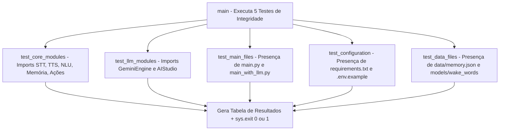

# Documentação Técnica: Suíte de Validação Completa (`testes/test_kamila_completa.py`)

Esta documentação descreve o funcionamento e as verificações executadas pelo script **`test_kamila_completa.py`**, localizado em `testes/test_kamila_completa.py`. Este módulo é uma **suíte de auditoria estrutural e funcional** projetada para garantir que todos os pacotes, configurações e bancos de dados da assistente **Kamila** estejam presentes e integrais.

---

## 1. Visão Geral da Arquitetura do Teste

O `test_kamila_completa.py` avalia 5 dimensões críticas da aplicação antes do deploy ou commit final:



---

## 2. Detalhamento dos 5 Módulos de Teste

### 2.1 `test_core_modules() -> bool`
- Testa a importação dinâmica dos 5 motores fundamentais:
  - `STTEngine` (`core.stt_engine`)
  - `TTSEngine` (`core.tts_engine`)
  - `CommandInterpreter` (`core.interpreter`)
  - `MemoryManager` (`core.memory_manager`)
  - `ActionManager` (`core.actions`)

---

### 2.2 `test_llm_modules() -> bool`
- Valida o módulo de inteligência artificial generativa:
  - `GeminiEngine` (`llm.gemini_engine`)
  - `AIStudioIntegration` (`llm.ai_studio_integration`)

---

### 2.3 `test_main_files() -> bool`
- Verifica se os pontos de entrada de produção existem nos caminhos esperados:
  - `.kamila/main.py`
  - `.kamila/main_with_llm.py`

---

### 2.4 `test_configuration() -> bool`
- Valida o suporte de configuração e dependências:
  - `config/requirements.txt`
  - `.kamila/.env.example`

---

### 2.5 `test_data_files() -> bool`
- Confirma a persistência de banco de dados e binários:
  - `data/memory.json` (banco de dados JSON TinyDB / memória simples)
  - `models/wake_words` (modelos `.ppn`)

---

## 3. Estrutura do Relatório e Código de Retorno

```text
============================================================
📊 RESUMO DOS TESTES
============================================================
Módulos Core: ✅ PASSOU
Módulos LLM: ✅ PASSOU
Arquivos Main: ✅ PASSOU
Configuração: ✅ PASSOU
Arquivos de Dados: ✅ PASSOU

📈 Resultado Final: 5/5 testes passaram
🎉 TODOS OS TESTES PASSARAM!
```

- **`sys.exit(0)`**: Projeto saudável e totalmente funcional.
- **`sys.exit(1)`**: Falha na estrutura de diretórios ou em dependências do sistema.
