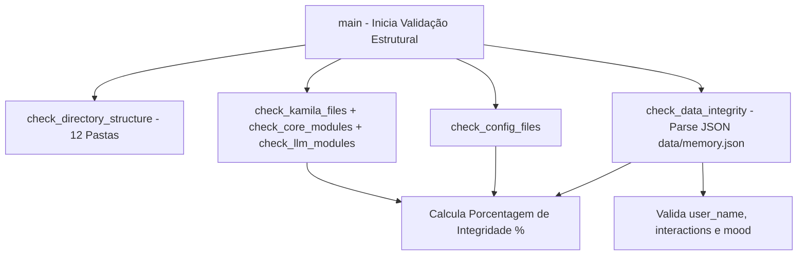

# Documentação Técnica: Validador Estrutural e de Dados (`testes/test_kamila_corrigido.py`)

Esta documentação descreve as verificações executadas pelo script **`test_kamila_corrigido.py`**, localizado em `testes/test_kamila_corrigido.py`. Este módulo é uma **ferramenta de auditoria de integridade física de arquivos e validação de schema JSON**, garantindo que nenhum arquivo de configuração ou diretório crítico tenha sido corrompido ou excluído.

---

## 1. Visão Geral do Módulo

Diferente de suítes de teste funcionais, o `test_kamila_corrigido.py` foca na verificação da existência de arquivos no sistema de arquivos e no parse válido do banco de dados `data/memory.json`.



---

## 2. Detalhamento dos Módulos de Validação

### 2.1 Estrutura de Diretórios (`check_directory_structure`)
Valida a presença dos 12 diretórios obrigatórios do ecossistema:
- `.kamila`, `.kamila/core`, `.kamila/llm`, `config`, `data`, `docs`, `models`, `audio`, `hardware`, `logs`, `scripts`, `deployment`.

---

### 2.2 Verificação de Arquivos de Código
- **`check_kamila_files()`**: `main.py`, `main_with_llm.py`, `__init__.py`, `.env.example`.
- **`check_core_modules()`**: `stt_engine.py`, `tts_engine.py`, `interpreter.py`, `memory_manager.py`, `actions.py`.
- **`check_llm_modules()`**: `gemini_engine.py`, `ai_studio_integration.py`, `test_llm_modules.py`, `requirements_gemini.txt`, `README.md`, `__init__.py`.
- **`check_config_files()`**: `config/requirements.txt`, `data/memory.json`, `docs/README.md`, `TODO_LLM_ORGANIZADO.md`.

---

### 2.3 Auditoria do Schema de Memória (`check_data_integrity`)
Realiza a leitura e decodificação do arquivo JSON `data/memory.json`, extraindo e exibindo no log:
- **`user_name`**: Nome cadastrado do usuário.
- **`interactions`**: Contador de mensagens trocadas.
- **`mood`**: Estado emocional atual da assistente.

---

## 3. Relatório de Desempenho em Porcentagem

O script calcula dinamicamente a taxa de saúde da aplicação:

```text
📊 RESUMO FINAL
============================================================
✅ Testes passados: 31
📋 Total de testes: 31
📈 Porcentagem: 100.0%
🎉 PROJETO KAMILA 100% RECUPERADO!
```
