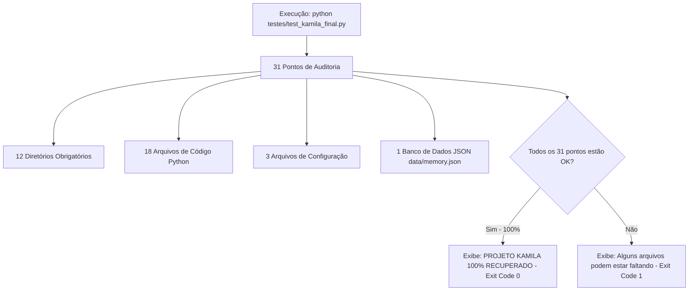

# Documentação Técnica: Gatekeeper de Qualidade Pré-Release (`testes/test_kamila_final.py`)

Esta documentação descreve o funcionamento e o papel do script **`test_kamila_final.py`**, localizado em `testes/test_kamila_final.py`. Este módulo atua como a **suíte final de aprovação (*Gatekeeper / Final Smoke Test*)**, executando 31 verificações de integridade estrutural e de dados antes de qualquer release ou deploy em produção.

---

## 1. Visão Geral do Gatekeeper de Qualidade

O `test_kamila_final.py` consolida a auditoria final da assistente **Kamila**, garantindo que nenhum artefato ou dependência crítica tenha sido removido do projeto.



---

## 2. Cobertura dos 31 Pontos de Auditoria

| Grupo | Quantidade | Componentes Verificados |
| :--- | :--- | :--- |
| **Estrutura de Pastas** | 12 | `.kamila`, `.kamila/core`, `.kamila/llm`, `config`, `data`, `docs`, `models`, `audio`, `hardware`, `logs`, `scripts`, `deployment` |
| **Arquivos Principais** | 4 | `.kamila/main.py`, `.kamila/main_with_llm.py`, `.kamila/__init__.py`, `.kamila/.env.example` |
| **Módulos Core** | 5 | `stt_engine.py`, `tts_engine.py`, `interpreter.py`, `memory_manager.py`, `actions.py` |
| **Módulos LLM** | 6 | `gemini_engine.py`, `ai_studio_integration.py`, `test_llm_modules.py`, `requirements_gemini.txt`, `README.md`, `__init__.py` |
| **Configurações** | 4 | `config/requirements.txt`, `data/memory.json`, `docs/README.md`, `TODO_LLM_ORGANIZADO.md` |
| **Integridade de Dados**| 1 | Validação e Parse JSON do `data/memory.json` (`user_name`, `interactions`, `mood`) |

---

## 3. Como Executar

No terminal ou script de CI/CD:

```bash
python testes/test_kamila_final.py
```
