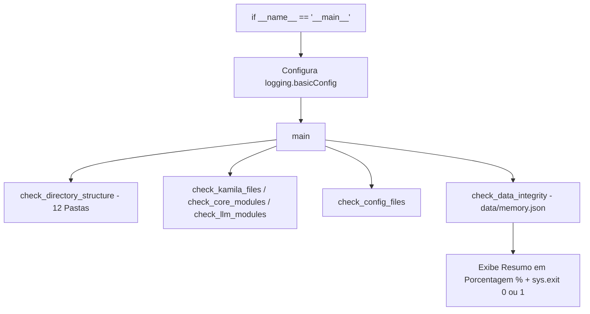

# Documentação Técnica: Teste Simplificado de Integridade (`testes/test_kamila_simples.py`)

Esta documentação descreve as especificações e o funcionamento do script **`test_kamila_simples.py`**, localizado no caminho `testes/test_kamila_simples.py`. Este módulo fornece uma **verificação rápida e isolada da estrutura física do projeto**, configurando os loggers do sistema dinamicamente na entrada principal.

---

## 1. Visão Geral da Arquitetura do Teste

O `test_kamila_simples.py` audita a integridade de 12 diretórios e 20 arquivos vitais do ecossistema, além de realizar a inspeção e parse do arquivo `data/memory.json`.



---

## 2. Cobertura de Verificações

1. **Pastas Principais (12)**: `.kamila`, `.kamila/core`, `.kamila/llm`, `config`, `data`, `docs`, `models`, `audio`, `hardware`, `logs`, `scripts`, `deployment`.
2. **Arquivos Core & LLM (15)**: `stt_engine.py`, `tts_engine.py`, `interpreter.py`, `memory_manager.py`, `actions.py`, `gemini_engine.py`, `ai_studio_integration.py`, `main.py`, `main_with_llm.py`, etc.
3. **Integridade JSON (1)**: Parse de `data/memory.json` extraindo `user_name`, `interactions` e `mood`.

---

## 3. Como Executar

No terminal:

```bash
python testes/test_kamila_simples.py
```
